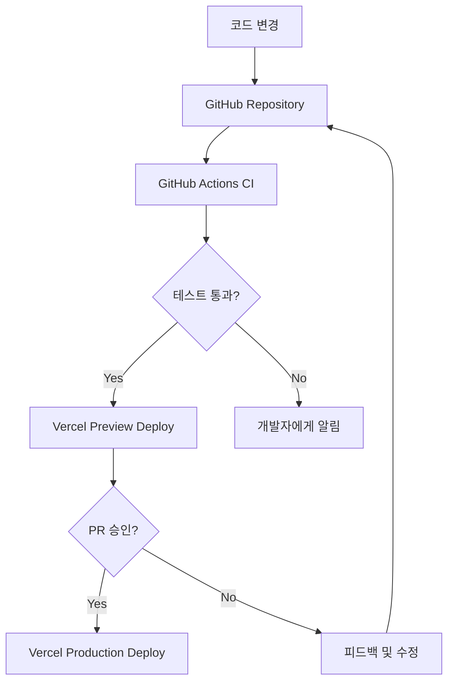

# KeywordPulse CI/CD 파이프라인 문서

이 문서는 KeywordPulse 프로젝트의 CI/CD(지속적 통합/지속적 배포) 파이프라인 구성과 workflow에 대한 정보를 제공합니다.

## 1. CI/CD 개요

### 1.1 아키텍처

KeywordPulse 프로젝트는 다음과 같은 CI/CD 파이프라인을 사용합니다:



### 1.2 사용 도구

- **GitHub Actions**: CI/CD 워크플로우 관리
- **Vercel**: 정적 사이트 호스팅 및 배포
- **Jest**: 자동화된 테스트
- **ESLint**: 코드 품질 검사
- **TypeScript**: 타입 검사

## 2. GitHub Actions Workflow

### 2.1 기본 워크플로우

KeywordPulse 프로젝트는 다음 GitHub Actions 워크플로우를 사용합니다:

**.github/workflows/ci.yml**:

```yaml
name: CI

on:
  push:
    branches: [ main ]
  pull_request:
    branches: [ main ]

jobs:
  build:
    runs-on: ubuntu-latest

    steps:
    - uses: actions/checkout@v3
    
    - name: Setup Node.js
      uses: actions/setup-node@v3
      with:
        node-version: '18'
        cache: 'npm'
    
    - name: Install dependencies
      run: npm ci
    
    - name: Run linting
      run: npm run lint
    
    - name: TypeScript type checking
      run: npm run type-check
    
    - name: Run tests
      run: npm test
      
    - name: Build
      run: npm run build
```

### 2.2 Pull Request 워크플로우

PR에 특화된 워크플로우를 구성하여, PR이 병합 가능한지 검증합니다:

**.github/workflows/pr.yml**:

```yaml
name: Pull Request

on:
  pull_request:
    types: [opened, synchronize, reopened]

jobs:
  validate:
    runs-on: ubuntu-latest
    steps:
    - uses: actions/checkout@v3
    
    - name: Setup Node.js
      uses: actions/setup-node@v3
      with:
        node-version: '18'
        cache: 'npm'
    
    - name: Install dependencies
      run: npm ci
    
    - name: Check dependencies for vulnerabilities
      run: npm audit --production
    
    - name: Run linting
      run: npm run lint
    
    - name: Run tests with coverage
      run: npm test -- --coverage
    
    - name: Upload coverage report
      uses: codecov/codecov-action@v3
```

## 3. Vercel 배포

### 3.1 Vercel 구성

Vercel은 GitHub 저장소와 직접 통합되어 자동 배포를 처리합니다. 다음과 같이 구성됩니다:

**vercel.json**:

```json
{
  "version": 2,
  "functions": {
    "api/*.py": {
      "runtime": "python3.10",
      "maxDuration": 30
    }
  },
  "builds": [
    {
      "src": "api/*.py",
      "use": "@vercel/python"
    },
    {
      "src": "package.json",
      "use": "@vercel/static-build"
    }
  ],
  "routes": [
    {
      "src": "/api/(.*)",
      "dest": "/api/main.py"
    },
    {
      "handle": "filesystem"
    },
    {
      "src": "/(.*)",
      "dest": "/out/$1"
    }
  ],
  "installCommand": "npm install",
  "buildCommand": "npm run build-static",
  "outputDirectory": "out",
  "github": {
    "enabled": true,
    "silent": false
  }
}
```

### 3.2 정적 내보내기 프로세스

Next.js 정적 내보내기(Static Export)는 Vercel에서 다음 단계를 통해 처리됩니다:

1. **npm run build-static**: 정적 내보내기 커스텀 스크립트 실행
2. **정적 파일 생성**: HTML, CSS, JS 파일이 `out` 디렉토리에 생성
3. **정적 파일 배포**: Vercel의 글로벌 CDN에 파일 배포

`build.js`를 통해 TypeScript 오류를 우회하여 빌드를 성공적으로 완료합니다.

## 4. 환경 구성

### 4.1 환경별 변수 관리

환경 변수는 다음과 같이 관리됩니다:

| 환경 | 관리 방법 |
|-----|----------|
| 로컬 개발 | `.env.local` |
| 테스트 | GitHub Secrets + Actions |
| 스테이징 | Vercel 환경 변수 (Preview) |
| 프로덕션 | Vercel 환경 변수 (Production) |

### 4.2 비밀 관리

비밀 값(API 키, 토큰 등)은 다음과 같이 관리합니다:

- **GitHub Secrets**: CI/CD 파이프라인에서 사용되는 비밀
- **Vercel 환경 변수**: 배포 환경에서 사용되는 비밀

## 5. 배포 전략

### 5.1 배포 흐름

KeywordPulse는 다음과 같은 배포 전략을 사용합니다:

1. **Feature Branch**: 새 기능 개발을 위한 브랜치 생성
2. **PR & Preview**: PR 생성 시 Vercel은 자동으로 프리뷰 환경 배포
3. **리뷰 및 테스트**: 코드 리뷰 및 프리뷰 환경에서 수동 테스트
4. **병합**: 승인 후 메인 브랜치에 병합
5. **자동 배포**: 메인 브랜치 업데이트 시 자동으로 프로덕션 배포

### 5.2 Rollback 전략

문제 발생 시 롤백 방법:

1. **Vercel Dashboard**: 이전 배포로 롤백
2. **Git Revert**: 문제의 커밋을 되돌리고 새 배포 트리거

## 6. 모니터링 및 알림

### 6.1 배포 알림

배포 상태 알림 채널:

- **GitHub**: 워크플로우 실행 결과 저장
- **Slack**: 중요 배포 이벤트 알림 (성공/실패)
- **이메일**: 크리티컬 실패에 대한 알림

### 6.2 오류 모니터링

프로덕션 환경의 오류는 다음을 통해 모니터링합니다:

- **Sentry**: 클라이언트 및 서버 오류 추적
- **Vercel Analytics**: 사용자 경험 및 성능 모니터링

## 7. CI/CD 성능 최적화

### 7.1 빌드 최적화

빌드 시간을 줄이기 위한 전략:

- **캐싱**: npm 및 Next.js 빌드 캐시 활용
- **병렬 작업**: 가능한 경우 CI 작업 병렬화
- **선택적 재빌드**: 변경된 파일에만 영향을 미치는 테스트 실행

### 7.2 테스트 최적화

CI에서 테스트 실행 최적화:

- **선택적 테스트**: 변경된 코드에 관련된 테스트만 실행
- **타임아웃 설정**: 장시간 실행되는 테스트 방지
- **테스트 분할**: 큰 테스트 세트를 여러 작업으로 분할

## 8. 보안 검사

### 8.1 자동화된 보안 검사

CI 파이프라인에 포함된 보안 검사:

- **npm audit**: 의존성 취약점 검사
- **CodeQL**: 코드 품질 및 보안 분석
- **SAST(Static Application Security Testing)**: 정적 애플리케이션 보안 테스트

### 8.2 의존성 업데이트

의존성 최신화를 위한 워크플로우:

- **Dependabot**: 의존성 자동 업데이트 PR 생성
- **주간 의존성 검토**: 팀이 보안 업데이트 검토 및 승인

## 9. 백업 및 복구

### 9.1 데이터 백업 전략

- **Supabase 자동 백업**: 데이터베이스 일일 백업
- **코드 저장소**: GitHub 및 추가 원격 저장소 백업

### 9.2 재해 복구 계획

서비스 중단 시 복구 단계:

1. **원인 분석**: 장애 원인 파악
2. **롤백 결정**: 필요 시 이전 버전으로 롤백
3. **데이터 복구**: 필요 시 백업에서 데이터 복원
4. **재배포**: 수정된 코드 배포

## 10. 문서화 및 교육

### 10.1 문서화

CI/CD 파이프라인의 문서화 위치:

- **GitHub Wiki**: 파이프라인 개요 및 구성 방법
- **Docs 폴더**: 상세 설정 및 운영 가이드
- **README.md**: 기본 설정 및 개발 흐름

### 10.2 온보딩

새 팀원 온보딩 프로세스:

1. 저장소 접근 권한 부여
2. CI/CD 파이프라인 개요 교육
3. 첫 PR을 통한 실습

---

이 문서는 프로젝트의 진행 상황에 따라 지속적으로 업데이트됩니다.

최종 업데이트: 2023-05-04 