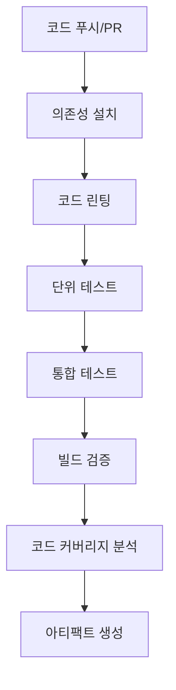

# CI/CD 파이프라인 문서

이 문서는 KeywordPulse 프로젝트의 CI/CD(지속적 통합/지속적 배포) 파이프라인 구성 및 작업 흐름을 설명합니다.

## 1. CI/CD 개요

KeywordPulse 프로젝트는 GitHub Actions와 Vercel을 활용하여 완전 자동화된 CI/CD 파이프라인을 구축했습니다. 이 파이프라인은 다음과 같은 장점을 제공합니다:

- 코드 품질 및 테스트 자동화
- 일관된 빌드 및 배포 프로세스
- 빠른 피드백 루프
- 안정적인 배포 및 롤백 기능

## 2. 파이프라인 구성

### 2.1 CI 파이프라인 (GitHub Actions)



### 2.2 CD 파이프라인 (Vercel)

```mermaid
graph TD
    A[CI 통과] --> B[Vercel 배포 트리거]
    B --> C[프리뷰 배포 (PR)]
    B --> D[프로덕션 배포 (main 브랜치)]
    C --> E[배포 검증]
    D --> E
    E --> F[배포 성공 알림]
```

## 3. GitHub Actions 워크플로우

프로젝트의 CI 워크플로우는 `.github/workflows/ci.yml` 파일에 정의되어 있습니다.

### 3.1 주요 작업 단계

1. **코드 체크아웃**: 저장소 코드 가져오기
2. **환경 설정**: Node.js 및 Python 설정
3. **의존성 설치**: npm 및 pip 의존성 설치
4. **린팅**: ESLint 및 Prettier를 사용한 코드 품질 검사
5. **테스트**: Jest 및 pytest를 사용한 자동 테스트 실행
6. **커버리지 보고서**: 테스트 커버리지 측정 및 보고서 생성
7. **빌드 검증**: Next.js 앱 빌드 검증

### 3.2 워크플로우 트리거

다음 이벤트가 워크플로우를 트리거합니다:

- **push**: main 브랜치에 코드 푸시
- **pull_request**: 모든 브랜치에서 main 브랜치로의 PR

## 4. Vercel 배포 구성

KeywordPulse는 Vercel의 Git 통합 기능을 활용하여 CD를 구현합니다.

### 4.1 배포 설정

- **프로덕션 배포**: main 브랜치에 병합 시 자동 배포
- **프리뷰 배포**: PR 생성 시 자동 배포 (검토용)
- **배포 환경 변수**: Vercel 대시보드에서 관리

### 4.2 배포 구성 파일

프로젝트 루트의 `vercel.json` 파일에 배포 설정이 정의되어 있습니다:

```json
{
  "version": 2,
  "builds": [
    {
      "src": "package.json",
      "use": "@vercel/next"
    },
    {
      "src": "api/**/*.py",
      "use": "@vercel/python"
    }
  ],
  "routes": [
    {
      "src": "/api/(.*)",
      "dest": "/api/$1"
    },
    {
      "src": "/(.*)",
      "dest": "/$1"
    }
  ],
  "env": {
    "NODE_ENV": "production"
  }
}
```

## 5. 환경 변수 관리

### 5.1 환경 별 변수 관리

- **개발 환경**: `.env.local` 파일
- **CI 환경**: GitHub Actions Secrets
- **프로덕션 환경**: Vercel 환경 변수

### 5.2 중요 환경 변수

- `NEXT_PUBLIC_SUPABASE_URL`: Supabase URL
- `NEXT_PUBLIC_SUPABASE_ANON_KEY`: Supabase 익명 키
- `API_SECRET_KEY`: API 보안 키
- `VERCEL_TOKEN`: Vercel 배포 토큰

## 6. 배포 전략

### 6.1 브랜치 전략

- **main**: 프로덕션 코드, 직접 푸시 금지
- **develop**: 개발 브랜치, 기능 브랜치 병합
- **feature/***:  기능 개발 브랜치
- **bugfix/***:  버그 수정 브랜치
- **hotfix/***:  긴급 픽스 브랜치

### 6.2 릴리스 프로세스

1. 개발자가 기능 브랜치에서 작업
2. PR을 develop 브랜치로 요청
3. 코드 리뷰 및 CI 검증 통과 후 develop에 병합
4. develop에서 main으로 릴리스 PR 생성
5. 릴리스 PR 승인 및 병합
6. Vercel이 자동으로 프로덕션 배포

### 6.3 롤백 절차

1. Vercel 대시보드에서 이전 배포로 롤백
2. 필요한 경우 main 브랜치에 revert 커밋 푸시

## 7. 모니터링 및 알림

### 7.1 배포 알림

- GitHub 이메일 알림
- Vercel 배포 알림
- Slack 통합 (선택 사항)

### 7.2 오류 모니터링

- Vercel 로그 및 알림
- Sentry 통합 오류 추적
- 사용자 행동 분석 (선택 사항)

## 8. 성능 최적화

### 8.1 빌드 최적화

- **캐싱**: GitHub Actions의 의존성 캐싱
- **병렬 작업**: 독립적인 작업 병렬 실행

### 8.2 배포 최적화

- **증분 정적 재생성**: Next.js ISR 활용
- **에지 캐싱**: Vercel 에지 네트워크 활용
- **이미지 최적화**: Next.js Image 컴포넌트 사용

## 9. 보안 고려사항

- PR 병합 전 코드 리뷰 필수
- 환경 변수와 시크릿 안전하게 관리
- 의존성 취약점 검사 자동화
- 정기적인 보안 감사

## 10. 개선 계획

- **E2E 테스트 추가**: Cypress 통합
- **성능 테스트 추가**: Lighthouse CI 통합
- **국제화 배포 파이프라인**: 다중 언어/지역 지원
- **A/B 테스트**: 다양한 버전 동시 배포 및 테스트

---

이 문서는 프로젝트의 진행 상황에 따라 지속적으로 업데이트됩니다. 