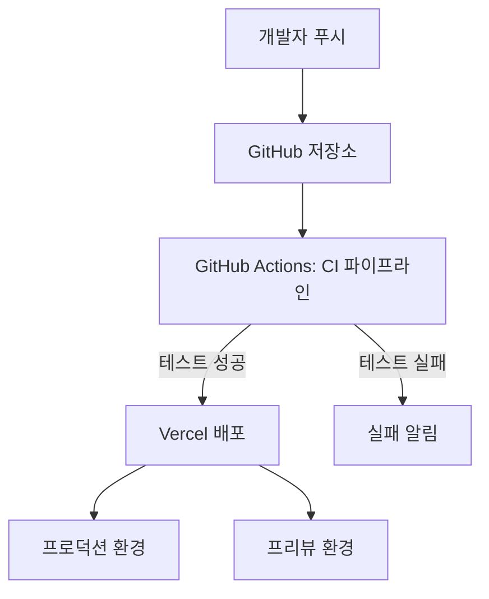

# KeywordPulse CI/CD 파이프라인 설정 가이드

이 문서는 KeywordPulse 프로젝트의 CI/CD(지속적 통합 및 배포) 파이프라인 설정 방법과 일반적인 문제 해결 방법을 설명합니다.

## 1. CI/CD 아키텍처 개요

KeywordPulse 프로젝트는 다음과 같은 CI/CD 워크플로우를 사용합니다:



## 2. GitHub Actions 설정

### 2.1 기본 CI 워크플로우

`.github/workflows/ci.yml` 파일은 다음과 같이 구성됩니다:

```yaml
name: CI

on:
  push:
    branches: [ main ]
  pull_request:
    branches: [ main ]

jobs:
  test:
    runs-on: ubuntu-latest
    steps:
      - uses: actions/checkout@v3
      - name: Set up Node.js
        uses: actions/setup-node@v3
        with:
          node-version: '18'
          cache: 'npm'
      - name: Install dependencies
        run: npm ci
      - name: Run tests
        run: npm test
      - name: Lint
        run: npm run lint
```

### 2.2 경로 검증 워크플로우

파일 경로 일관성을 검증하는 워크플로우:

```yaml
name: Path Validation

on:
  push:
    branches: [ main ]
  pull_request:
    branches: [ main ]

jobs:
  validate:
    runs-on: ubuntu-latest
    steps:
      - uses: actions/checkout@v3
      - name: Set up Node.js
        uses: actions/setup-node@v3
        with:
          node-version: '18'
          cache: 'npm'
      - name: Install dependencies
        run: npm ci
      - name: Check path consistency
        run: npm run path:check
```

## 3. Vercel 배포 설정

### 3.1 기본 배포 설정

Vercel 배포는 `vercel.json` 파일에 정의된 설정을 사용합니다:

```json
{
  "version": 2,
  "builds": [
    {
      "src": "package.json",
      "use": "@vercel/next",
      "config": {
        "installCommand": "npm install typescript && npm install --omit=dev",
        "buildCommand": "npm run build"
      }
    }
  ],
  "routes": [
    {
      "src": "/(.*)",
      "dest": "/$1"
    }
  ],
  "github": {
    "silent": true
  }
}
```

### 3.2 환경 변수 설정

Vercel 프로젝트에 설정해야 하는 필수 환경 변수:

| 환경 변수 | 설명 | 필수 여부 |
|----------|------|---------|
| NEXT_PUBLIC_SUPABASE_URL | Supabase 프로젝트 URL | 필수 |
| NEXT_PUBLIC_SUPABASE_ANON_KEY | Supabase 익명 키 | 필수 |
| TELEGRAM_BOT_TOKEN | Telegram 봇 토큰 (알림용) | 선택 |
| TELEGRAM_CHAT_ID | Telegram 채팅 ID (알림용) | 선택 |
| NEXT_PUBLIC_APP_URL | 배포된 앱 URL | 필수 |
| SENTRY_DSN | Sentry 오류 추적 DSN | 선택 |

## 4. 배포 오류 해결 가이드

### 4.1 TypeScript 의존성 문제 해결

Vercel 배포 시 TypeScript 관련 오류가 발생할 경우:

1. **TypeScript 의존성 위치 확인**
   - TypeScript는 `devDependencies`가 아닌 `dependencies`에 있어야 합니다.
   - 해결 방법:
   ```json
   // package.json
   "dependencies": {
     // 다른 의존성들...
     "typescript": "5.8.3"
   }
   ```

2. **설치 명령어 수정**
   - `vercel.json` 파일의 `installCommand`를 수정합니다:
   ```json
   "installCommand": "npm install typescript && npm install --omit=dev"
   ```

3. **빌드 스크립트 최적화**
   - `build.js` 스크립트를 사용하여 TypeScript 오류를 우회할 수 있습니다.
   - 이 스크립트는 빌드 전에 TypeScript 설치를 확인하고, 필요시 설치를 수행합니다.

### 4.2 빌드 스크립트 문제 해결

빌드 스크립트(`build.js`)가 실행되는 동안 문제가 발생하면:

1. **상세 로그 확인**
   - 빌드 로그에서 TypeScript 오류 메시지 확인
   - 패키지 설치 과정에서 오류 여부 확인

2. **수동으로 TypeScript 설치 강제화**
   ```json
   "scripts": {
     "prebuild": "npm install typescript --save",
     "build": "next build"
   }
   ```

3. **빌드 오류 무시 설정**
   - `next.config.js`에서 빌드 중 TypeScript 오류를 무시할 수 있습니다:
   ```javascript
   typescript: {
     ignoreBuildErrors: true,
   },
   eslint: {
     ignoreDuringBuilds: true,
   },
   ```

### 4.3 인코딩 관련 문제 해결

`next.config.js` 파일에서 인코딩 문제가 발생할 경우:

1. **파일 인코딩 확인**
   - 모든 설정 파일은 UTF-8로 저장되어야 합니다.
   - Visual Studio Code에서 파일 하단 상태 표시줄에서 인코딩 확인

2. **한글 주석 처리**
   - 코드 파일에 있는 한글 주석이 깨지는 경우 새로운 파일로 저장

## 5. 배포 프로세스 모니터링

### 5.1 배포 상태 확인

Vercel 배포 상태는 다음 위치에서 확인할 수 있습니다:
- Vercel 대시보드: [https://vercel.com/bzjay53/keywordpulse](https://vercel.com/bzjay53/keywordpulse)
- GitHub 저장소의 "Deployments" 탭

### 5.2 배포 알림 설정

배포 상태에 대한 알림을 받을 수 있도록 설정:

1. **Slack 알림**
   - Vercel 프로젝트 설정에서 Slack 통합 구성

2. **Telegram 알림**
   - `deploy.js` 스크립트를 사용하여 배포 상태를 Telegram으로 전송
   ```javascript
   const TelegramBot = require('node-telegram-bot-api');
   const bot = new TelegramBot(process.env.TELEGRAM_BOT_TOKEN, { polling: false });
   bot.sendMessage(process.env.TELEGRAM_CHAT_ID, '배포가 성공적으로 완료되었습니다.');
   ```

## 6. CI/CD 파이프라인 확장

### 6.1 성능 테스트 추가

Lighthouse CI를 통합하여 성능 측정을 자동화할 수 있습니다:

```yaml
name: Lighthouse CI

on:
  push:
    branches: [ main ]

jobs:
  lighthouse:
    runs-on: ubuntu-latest
    steps:
      - uses: actions/checkout@v3
      - name: Lighthouse CI
        uses: treosh/lighthouse-ci-action@v9
        with:
          urls: |
            https://keywordpulse.vercel.app/
          uploadArtifacts: true
          temporaryPublicStorage: true
```

### 6.2 보안 검사 추가

코드베이스의 보안 취약점을 검사하는 워크플로우:

```yaml
name: Security Scan

on:
  push:
    branches: [ main ]
  schedule:
    - cron: '0 0 * * 0'  # 매주 일요일 실행

jobs:
  security:
    runs-on: ubuntu-latest
    steps:
      - uses: actions/checkout@v3
      - name: Run npm audit
        run: npm audit --production
      - name: Run Snyk to check for vulnerabilities
        uses: snyk/actions/node@master
        env:
          SNYK_TOKEN: ${{ secrets.SNYK_TOKEN }}
```

## 7. 권장 배포 전략

### 7.1 Feature Branch 배포

- 각 기능 브랜치에 대해 프리뷰 배포를 생성하여 리뷰어가 변경 사항을 확인할 수 있도록 합니다.
- Vercel 대시보드에서 "Git Integration" 설정에서 "Preview Branch Deployments" 활성화

### 7.2 Canary 배포

- 주요 릴리스 전에 일부 사용자에게만 새 버전을 배포할 수 있습니다.
- 이를 위해 `vercel.json`에 다음 설정을 추가:

```json
{
  "routes": [
    {
      "src": "/(.*)",
      "dest": "/$1",
      "continue": true,
      "has": [
        {
          "type": "cookie",
          "key": "canary",
          "value": "true"
        }
      ]
    }
  ]
}
```

## 8. 문제 해결 및 디버깅

### 8.1 일반적인 문제

1. **"Module not found" 오류**
   - 의존성이 제대로 설치되지 않았거나 경로 문제일 수 있습니다.
   - 해결: `npm install` 다시 실행, 경로 검증 스크립트 실행

2. **TypeScript 컴파일 오류**
   - TypeScript 버전 문제나 타입 정의 문제일 수 있습니다.
   - 해결: TypeScript 버전 고정, 타입 정의 업데이트

3. **"Cannot find module 'typescript'"**
   - Vercel 배포 환경에서 TypeScript가 누락되었을 수 있습니다.
   - 해결: 위의 TypeScript 의존성 문제 해결 방법 참조

### 8.2 Vercel 로그 확인

빌드 및 배포 문제를 디버깅하기 위해 Vercel 빌드 로그를 확인합니다:

1. Vercel 대시보드에서 문제가 있는 배포 선택
2. "Functions" 탭에서 실패한 함수 확인
3. "Build Logs" 탭에서 빌드 오류 세부 정보 확인

## 9. 배포 성능 최적화

배포 시간을 줄이기 위한 최적화 방법:

1. **빌드 캐시 활용**
   - Vercel은 기본적으로 빌드 캐시를 활용합니다.
   - `.vercelignore` 파일을 사용하여 불필요한 파일 제외

2. **종속성 설치 최적화**
   - 필요한 종속성만 설치하도록 `installCommand` 설정
   - `npm ci` 명령어 사용하여 설치 속도 향상

3. **정적 자산 최적화**
   - 이미지 및 정적 파일 압축
   - `next.config.js`에서 이미지 최적화 설정

## 10. 향후 개선 계획

1. **자동화된 배포 테스트 구현**
   - 배포 후 자동으로 기본 기능 테스트 실행

2. **배포 롤백 자동화**
   - 배포 후 오류율이 증가하면 자동으로 이전 버전으로 롤백

3. **성능 모니터링 통합**
   - Lighthouse CI와 GitHub Actions 통합
   - 성능 예산 설정 및 모니터링

---

본 문서는 KeywordPulse 프로젝트의 CI/CD 파이프라인 설정 및 유지 관리 방법에 대한 종합적인 가이드입니다. 질문이나 제안이 있으면 프로젝트 관리자에게 문의하십시오. 