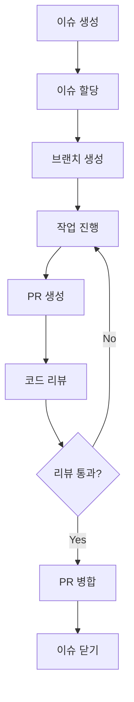

# 팀 협업 가이드 문서

이 문서는 KeywordPulse 프로젝트의 팀 협업 방식, 커뮤니케이션 채널, 작업 흐름 및 관련 도구에 대한 가이드라인을 제공합니다.

## 1. 프로젝트 커뮤니케이션

### 1.1 커뮤니케이션 채널

- **Slack**: 일상적인 커뮤니케이션 및 빠른 질문
  - `#keywordpulse-general`: 일반 논의
  - `#keywordpulse-dev`: 개발 관련 논의
  - `#keywordpulse-design`: UI/UX 논의
  - `#keywordpulse-alerts`: 자동 알림(CI/CD, 모니터링)

- **GitHub Issues/PR**: 코드 관련 논의, 버그 리포트, 코드 리뷰
- **주간 회의**: 매주 월요일 10:00 AM (팀 전체)
- **일일 스탠드업**: 매일 9:30 AM (15분, 개발팀)

### 1.2 문서화 표준

- 모든 주요 결정은 문서화
- 회의록은 공유 노션 페이지에 보관
- 기술적 결정(ADR)은 `/Docs` 디렉터리에 저장

## 2. 작업 관리

### 2.1 이슈 관리

- **GitHub Issues** 사용
- 이슈 템플릿 활용:
  - 버그 리포트
  - 기능 요청
  - 문서 업데이트

### 2.2 이슈 라벨

- `bug`: 버그 또는 오류
- `feature`: 새로운 기능
- `enhancement`: 기존 기능 개선
- `documentation`: 문서 관련
- `high-priority`: 높은 우선순위
- `blocked`: 다른 작업에 종속됨
- `refactor`: 코드 리팩토링
- `test`: 테스트 관련
- `ui`: 사용자 인터페이스
- `api`: API 관련

### 2.3 작업 흐름



### 2.4 진행 상황 추적

- **GitHub Projects** 칸반 보드 사용
- 열:
  - `Backlog`: 계획된 작업
  - `To Do`: 다음에 진행할 작업
  - `In Progress`: 진행 중인 작업
  - `Review`: 리뷰 중인 작업
  - `Done`: 완료된 작업

## 3. 버전 관리

### 3.1 브랜치 전략

- **메인 브랜치**:
  - `main`: 프로덕션 코드, 항상 배포 가능한 상태
  - `develop`: 개발 통합 브랜치

- **기능 브랜치**:
  - `feature/feature-name`: 새 기능 개발
  - `bugfix/bug-description`: 버그 수정
  - `hotfix/issue-description`: 긴급 수정
  - `docs/documentation-update`: 문서 업데이트
  - `refactor/component-name`: 코드 리팩토링

### 3.2 커밋 메시지 규칙

- 형식: `<type>(<scope>): <subject>`
- 유형:
  - `feat`: 새 기능
  - `fix`: 버그 수정
  - `docs`: 문서 변경
  - `style`: 코드 포맷팅, 세미콜론 누락 등
  - `refactor`: 코드 리팩토링
  - `test`: 테스트 추가/수정
  - `chore`: 빌드 프로세스 변경, 종속성 업데이트 등

예시:
```
feat(auth): 소셜 로그인 기능 추가
fix(api): 키워드 분석 API 타임아웃 문제 해결
docs(readme): 설치 지침 업데이트
```

### 3.3 Pull Request 프로세스

1. PR 생성 시 템플릿 사용
2. 관련 이슈 연결
3. 기능/버그 수정 설명
4. 필요한 스크린샷 첨부
5. 최소 1명의 팀원이 승인해야 병합 가능
6. CI 테스트 통과 필수

## 4. 코드 리뷰

### 4.1 코드 리뷰 목적

- 버그와 논리적 오류 포착
- 코드 품질 및 일관성 유지
- 모범 사례 및 지식 공유
- 코드 소유권 분산

### 4.2 코드 리뷰 기준

- 기능 요구사항 충족
- 코드 스타일 가이드 준수
- 적절한 테스트 포함
- 성능 및 보안 고려
- 유지 관리성 및 가독성

### 4.3 코드 리뷰 에티켓

- 코드, 아이디어에 댓글 달기 (사람이 아님)
- 긍정적인 부분 함께 언급
- 명확하고 구체적인 피드백 제공
- 제안과 질문으로 소통

## 5. 개발 환경 설정

### 5.1 개발 환경 요구 사항

- Node.js v18 이상
- npm v8 이상
- Python 3.10 이상
- Git
- VS Code (권장 편집기)

### 5.2 개발 환경 설정 단계

```bash
# 1. 저장소 클론
git clone https://github.com/organization/keywordpulse.git
cd keywordpulse

# 2. 의존성 설치
npm install

# 3. Python 의존성 설치 (필요한 경우)
pip install -r requirements.txt

# 4. 환경 변수 설정
cp .env.example .env.local
# .env.local 파일 수정

# 5. 개발 서버 실행
npm run dev
```

### 5.3 권장 VS Code 확장

- ESLint
- Prettier
- GitLens
- Tailwind CSS IntelliSense
- Python
- Jest Runner

## 6. 팀 역할 및 책임

### 6.1 팀 구성

- **프론트엔드 개발자**
  - React/Next.js 컴포넌트 개발
  - UI 구현 및 상태 관리
  - 프론트엔드 성능 최적화

- **백엔드 개발자**
  - API 개발 및 통합
  - 서버리스 함수 구현
  - 데이터베이스 모델링

- **UI/UX 디자이너**
  - 사용자 인터페이스 디자인
  - 사용자 경험 연구
  - 디자인 시스템 관리

- **QA 엔지니어**
  - 테스트 케이스 작성
  - 자동화 테스트 구현
  - 버그 리포팅 및 추적

- **DevOps 엔지니어**
  - CI/CD 파이프라인 관리
  - 인프라 구성 및 모니터링
  - 배포 자동화

### 6.2 의사 결정 프로세스

- 기술적 결정: 관련 팀원 간의 토론 → 합의
- 주요 변경 사항: 전체 팀 논의 → 기술 리드 최종 결정
- 긴급 수정: 담당 개발자 즉시 조치 → 사후 팀 공유

## 7. 품질 보증

### 7.1 코드 품질 기준

- ESLint/Prettier 설정 준수
- 모든 새 코드에 테스트 포함
- 테스트 커버리지 목표: 최소 80%
- 주기적인 코드 품질 검토

### 7.2 CI/CD 파이프라인

- GitHub Actions를 통한 자동화:
  - 코드 린팅
  - 단위 및 통합 테스트
  - 빌드 검증
  - 테스트 커버리지 보고
  - Vercel 자동 배포

### 7.3 릴리스 프로세스

- 2주 단위 스프린트
- 각 스프린트 후 릴리스
- 릴리스 노트 작성 및 공유
- 배포 후 모니터링

## 8. 기술 스택 개요

- **프론트엔드**: Next.js, React, TypeScript, TailwindCSS
- **백엔드**: Next.js API 라우트, FastAPI, Supabase
- **데이터베이스**: PostgreSQL (Supabase)
- **인증**: Supabase Auth
- **배포**: Vercel
- **CI/CD**: GitHub Actions

## 9. 온보딩 프로세스

### 9.1 신규 팀원 온보딩

1. 저장소 접근 권한 부여
2. 슬랙 채널 초대
3. 개발 환경 설정 지원
4. 주요 문서 및 코드베이스 소개
5. 멘토 지정 (처음 2주)
6. 작은 작업 할당으로 시작

### 9.2 권장 학습 자료

- Next.js 공식 문서
- Supabase 튜토리얼
- TailwindCSS 가이드
- 프로젝트 아키텍처 문서

## 10. 지속적 개선

- 스프린트 회고 회의
- 정기적인 프로세스 검토
- 팀 피드백 수집 및 개선 구현
- 기술 부채 관리를 위한 정기 리팩토링

---

이 문서는 프로젝트의 진행 상황에 따라 지속적으로 업데이트됩니다. 