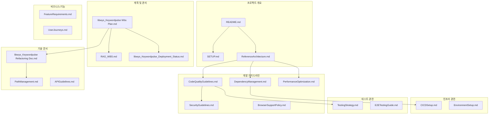

# KeywordPulse 문서 맵

이 문서는 KeywordPulse 프로젝트의 전체 문서 구조를 설명하는 맵입니다. 각 문서의 목적과 상호 관계를 이해하는 데 도움이 됩니다.

## 1. 프로젝트 개요 문서

| 문서 이름 | 설명 | 주요 대상 |
|---------|------|----------|
| [README.md](../README.md) | 프로젝트 소개 및 시작 가이드 | 모든 개발자, 신규 참여자 |
| [SETUP.md](../SETUP.md) | 개발 환경 설정 가이드 | 신규 개발자 |
| [ReferenceArchitecture.md](./ReferenceArchitecture.md) | 시스템 아키텍처 개요 및 구조 | 모든 개발자, 아키텍트 |

## 2. 계획 및 관리 문서

| 문서 이름 | 설명 | 주요 대상 |
|---------|------|----------|
| [libwys_Keywordpulse Wbs Plan.md](./libwys_Keywordpulse%20Wbs%20Plan.md) | 작업 분해 구조 및 일정 계획 | 프로젝트 관리자, 개발팀 |
| [RAG_WBS.md](./RAG_WBS.md) | RAG 시스템 개발 작업 분해 구조 | AI 개발팀 |
| [libwys_Keywordpulse_Deployment_Status.md](./libwys_Keywordpulse_Deployment_Status.md) | 배포 상태 및 계획 | DevOps, 프로젝트 관리자 |

## 3. 개발 가이드라인 문서

| 문서 이름 | 설명 | 주요 대상 |
|---------|------|----------|
| [CodeQualityGuidelines.md](./CodeQualityGuidelines.md) | 코드 품질 표준 및 모범 사례 | 모든 개발자 |
| [SecurityGuidelines.md](./SecurityGuidelines.md) | 보안 관련 가이드라인 | 모든 개발자 |
| [PerformanceOptimization.md](./PerformanceOptimization.md) | 성능 최적화 전략 | 프론트엔드 개발자 |
| [DependencyManagement.md](./DependencyManagement.md) | 패키지 및 의존성 관리 가이드 | 모든 개발자 |
| [BrowserSupportPolicy.md](./BrowserSupportPolicy.md) | 지원 브라우저 정책 | 프론트엔드 개발자 |

## 4. 기술 문서

| 문서 이름 | 설명 | 주요 대상 |
|---------|------|----------|
| [libwys_Keywordpulse Refactoring Doc.md](./libwys_Keywordpulse%20Refactoring%20Doc.md) | 리팩토링 계획 및 가이드 | 개발팀 |
| [PathManagement.md](./PathManagement.md) | 파일 경로 관리 가이드 | 개발팀 |
| [APIGuidelines.md](./APIGuidelines.md) | API 설계 및 구현 가이드 | 백엔드 개발자 |

## 5. 인프라 관련 문서

| 문서 이름 | 설명 | 주요 대상 |
|---------|------|----------|
| [CICDSetup.md](./CICDSetup.md) | CI/CD 파이프라인 설정 가이드 | DevOps 엔지니어 |
| [EnvironmentSetup.md](./EnvironmentSetup.md) | 개발/스테이징/운영 환경 설정 | DevOps 엔지니어 |

## 6. 테스트 관련 문서

| 문서 이름 | 설명 | 주요 대상 |
|---------|------|----------|
| [TestingStrategy.md](./TestingStrategy.md) | 테스트 전략 및 접근 방식 | QA, 개발자 |
| [E2ETestingGuide.md](./E2ETestingGuide.md) | 종단간 테스트 가이드 | QA 엔지니어 |

## 7. 비즈니스 및 기능 문서

| 문서 이름 | 설명 | 주요 대상 |
|---------|------|----------|
| [FeatureRequirements.md](./FeatureRequirements.md) | 기능 요구사항 명세 | 제품 관리자, 개발자 |
| [UserJourneys.md](./UserJourneys.md) | 사용자 여정 및 시나리오 | 디자이너, 개발자 |

## 문서 관계도

## 문서 관리 가이드라인

1. **문서 업데이트 빈도**:
   - 프로젝트 개요 문서: 주요 변경 시
   - 계획 및 관리 문서: 주간 또는 스프린트 단위
   - 개발 가이드라인: 필요 시, 분기별 검토
   - 기술 문서: 관련 코드 변경 시

2. **문서 작성 형식**:
   - Markdown 형식 사용
   - 명확한 제목과 구조화된 목차
   - 코드 예제가 있는 경우 문법 하이라이팅 사용
   - 다이어그램 필요 시 Mermaid 또는 PlantUML 사용

3. **문서 관리 책임**:
   - 각 문서에 주 담당자 지정
   - 문서 변경 시 PR 과정을 통한 리뷰

4. **문서 검색 및 접근**:
   - 이 문서 맵을 통해 모든 문서 접근
   - README의 문서 섹션에서 핵심 문서 링크

---

이 문서 맵은 프로젝트 진행에 따라 지속적으로 업데이트됩니다. 누락된 문서가 있거나 새로운 문서 추가가 필요한 경우 프로젝트 관리자에게 알려주세요. 