# 문서 맵 (Documentation Map)

이 문서는 KeywordPulse 프로젝트의 모든 문서에 대한 개요와 상호 참조를 제공합니다.

## 1. 프로젝트 개요 문서

| 문서 | 설명 | 주요 독자 | 최신 업데이트 |
|-----|------|----------|------------|
| [README.md](../README.md) | 프로젝트 소개 및 시작 가이드 | 모든 개발자, 사용자 | 2023-04-29 |
| [Architecture.md](./Architecture.md) | 프로젝트 구조도 및 아키텍처 | 개발자, 아키텍트 | 최근 |
| [Dependencies.md](./Dependencies.md) | 의존성 관리 문서 | 개발자 | 최근 |
| [SETUP.md](../SETUP.md) | 개발 환경 설정 가이드 | 신규 개발자 | 2023-04-29 |
| [EnvironmentVariablesGuide.md](./EnvironmentVariablesGuide.md) | 환경 변수 관리 지침 | 개발자, DevOps | 2023-04-29 |

## 2. 개발 가이드 문서

| 문서 | 설명 | 주요 독자 | 최신 업데이트 |
|-----|------|----------|------------|
| [CodeQualityGuidelines.md](./CodeQualityGuidelines.md) | 코드 품질 표준 및 모범 사례 | 개발자 | 최근 |
| [TestingStrategy.md](./TestingStrategy.md) | 테스트 전략 및 구현 지침 | 개발자, QA | 최근 |
| [CICDPipeline.md](./CICDPipeline.md) | CI/CD 파이프라인 구성 및 작업 흐름 | 개발자, DevOps | 최근 |
| [SecurityGuidelines.md](./SecurityGuidelines.md) | 보안 모범 사례 및 지침 | 개발자, 보안 담당자 | 최근 |
| [PerformanceOptimization.md](./PerformanceOptimization.md) | 성능 최적화 전략 및 구현 지침 | 개발자 | 최근 |
| [CollaborationGuide.md](./CollaborationGuide.md) | 팀 협업 방식 및 작업 흐름 | 모든 팀원 | 최근 |
| [DocumentationGuidelines.md](./DocumentationGuidelines.md) | 문서 작성 표준 및 지침 | 모든 팀원 | 최근 |

## 3. 구현 및 참조 문서

| 문서 | 설명 | 주요 독자 | 최신 업데이트 |
|-----|------|----------|------------|
| [libwys_Keywordpulse Reference Doc.md](./libwys_Keywordpulse%20Reference%20Doc.md) | 키워드 분석 참조 문서 | 개발자 | 최근 |
| [libwys_KeywordPulse API.md](./libwys_KeywordPulse%20API.md) | API 명세 및 사용법 | 개발자, 통합 개발자 | 최근 |
| [libwys_Keywordpulse Rag Doc.md](./libwys_Keywordpulse%20Rag%20Doc.md) | RAG 시스템 설계 및 구현 문서 | 개발자, AI 엔지니어 | 최근 |
| [libwys_Keywordpulse Supabase Auth.md](./libwys_Keywordpulse%20Supabase%20Auth.md) | Supabase 인증 통합 가이드 | 개발자 | 최근 |
| [libwys_Keywordpulse Seo Meta.md](./libwys_Keywordpulse%20Seo%20Meta.md) | SEO 및 메타데이터 구성 가이드 | 개발자, 마케팅 | 최근 |

## 4. 워크플로우 및 계획 문서

| 문서 | 설명 | 주요 독자 | 최신 업데이트 |
|-----|------|----------|------------|
| [libwys_Keywordpulse Wbs Plan.md](./libwys_Keywordpulse%20Wbs%20Plan.md) | 작업 분할 구조 및 일정 계획 | 프로젝트 관리자, 모든 팀원 | 최근 |
| [RAG_WBS.md](./RAG_WBS.md) | RAG 시스템 작업 분할 구조 | 개발자, AI 엔지니어 | 2023-04-29 |
| [libwys_Keywordpulse Refactoring Doc.md](./libwys_Keywordpulse%20Refactoring%20Doc.md) | 리팩토링 계획 및 전략 | 개발자 | 최근 |
| [libwys_requirement.md](./libwys_requirement.md) | 요구사항 명세서 | 모든 팀원 | 최근 |
| [libwys_plan.md](./libwys_plan.md) | 프로젝트 계획 및 로드맵 | 모든 팀원 | 최근 |

## 5. 운영 및 배포 문서

| 문서 | 설명 | 주요 독자 | 최신 업데이트 |
|-----|------|----------|------------|
| [libwys_Keywordpulse_Monitoring_Ops.md](./libwys_Keywordpulse_Monitoring_Ops.md) | 모니터링 및 운영 가이드 | 운영팀, DevOps | 최근 |
| [libwys_Keywordpulse_Deployment_Status.md](./libwys_Keywordpulse_Deployment_Status.md) | 배포 상태 및 로그 | 운영팀, DevOps | 최근 |
| [libwys_Keywordpulse_Vercel_Deployment.md](./libwys_Keywordpulse_Vercel_Deployment.md) | Vercel 배포 구성 가이드 | DevOps | 최근 |
| [libwys_Keywordpulse CI_CD Guide.md](./libwys_Keywordpulse%20CI_CD%20Guide.md) | CI/CD 구성 상세 가이드 | DevOps | 최근 |
| [libwys_Keywordpulse_Logging_Strategy.md](./libwys_Keywordpulse_Logging_Strategy.md) | 로깅 전략 및 구현 | 개발자, DevOps | 최근 |
| [StaticExportGuide.md](./StaticExportGuide.md) | 정적 내보내기 구성 및 배포 가이드 | 개발자, DevOps | 2023-04-29 |

## 6. 디버깅 및 테스트 문서

| 문서 | 설명 | 주요 독자 | 최신 업데이트 |
|-----|------|----------|------------|
| [libwys_Keywordpulse Debugging Guide.md](./libwys_Keywordpulse%20Debugging%20Guide.md) | 디버깅 프로세스 및 도구 | 개발자 | 최근 |
| [libwys_Keywordpulse Test Strategy.md](./libwys_Keywordpulse%20Test%20Strategy.md) | 테스트 전략 및 사례 | 개발자, QA | 최근 |

## 7. 사용자 문서

| 문서 | 설명 | 주요 독자 | 최신 업데이트 |
|-----|------|----------|------------|
| [libwys_Keywordpulse User Guide.md](./libwys_Keywordpulse%20User%20Guide.md) | 사용자 가이드 및 기능 설명 | 최종 사용자 | 최근 |
| [libwys_Keywordpulse Release Notes.md](./libwys_Keywordpulse%20Release%20Notes.md) | 릴리스 노트 및 변경 사항 | 모든 이해관계자 | 최근 |

## 8. 문서 간 관계도

```mermaid
graph TD
    A[README.md] --> B[Architecture.md]
    A --> C[SETUP.md]
    A --> Y[EnvironmentVariablesGuide.md]
    
    B --> D[Dependencies.md]
    B --> E[CodeQualityGuidelines.md]
    
    F[libwys_Keywordpulse Wbs Plan.md] --> G[RAG_WBS.md]
    F --> H[libwys_Keywordpulse Refactoring Doc.md]
    
    I[CICDPipeline.md] --> J[libwys_Keywordpulse CI_CD Guide.md]
    I --> K[libwys_Keywordpulse_Vercel_Deployment.md]
    I --> Z[StaticExportGuide.md]
    
    L[TestingStrategy.md] --> M[libwys_Keywordpulse Test Strategy.md]
    L --> N[libwys_Keywordpulse Debugging Guide.md]
    
    O[libwys_Keywordpulse Rag Doc.md] --> P[libwys_KeywordPulse API.md]
    O --> G
    
    Q[SecurityGuidelines.md] --> R[libwys_Keywordpulse Supabase Auth.md]
    Q --> Y
    
    S[PerformanceOptimization.md] --> T[libwys_Keywordpulse_Monitoring_Ops.md]
    S --> U[libwys_Keywordpulse Seo Meta.md]
    S --> Z
    
    V[CollaborationGuide.md] --> W[DocumentationGuidelines.md]
    W --> X[DocumentMap.md]
```



## 9. 문서 관리 가이드라인

### 9.1 문서 업데이트 프로세스

1. 모든 문서 변경은 PR을 통해 이루어져야 합니다.
2. 문서 변경 시 관련 문서도 함께 검토하고 필요시 업데이트합니다.
3. 문서 변경 후 이 문서 맵의 "최신 업데이트" 열을 갱신합니다.
4. 주요 문서 변경은 팀에 알립니다.

### 9.2 새 문서 추가 절차

1. 적절한 카테고리에 문서를 추가합니다.
2. 이 문서 맵에 새 문서를 등록합니다.
3. 관련 문서에 상호 참조를 추가합니다.
4. 새 문서 추가 PR을 생성하여 검토를 요청합니다.

## 10. 문서 폴더 구조

```
libwys/
├── README.md                  # 프로젝트 루트 README
├── SETUP.md                   # 설정 가이드
├── Docs/                      # 문서 루트 디렉토리
│   ├── Architecture.md        # 아키텍처 문서
│   ├── Dependencies.md        # 의존성 문서
│   ├── CodeQualityGuidelines.md # 코드 품질 가이드라인
│   ├── TestingStrategy.md     # 테스트 전략
│   ├── CICDPipeline.md        # CI/CD 파이프라인
│   ├── SecurityGuidelines.md  # 보안 가이드라인
│   ├── PerformanceOptimization.md # 성능 최적화
│   ├── CollaborationGuide.md  # 협업 가이드
│   ├── DocumentationGuidelines.md # 문서화 가이드라인
│   ├── DocumentMap.md         # 문서 맵 (이 문서)
│   ├── EnvironmentVariablesGuide.md # 환경 변수 관리 지침
│   ├── StaticExportGuide.md   # 정적 내보내기 가이드
│   └── ...                    # 기타 프로젝트 문서
```

---

이 문서는 프로젝트의 진행 상황에 따라 지속적으로 업데이트됩니다.

마지막 업데이트: 2023-04-29 