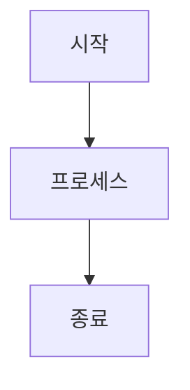

# 문서화 가이드라인

이 문서는 KeywordPulse 프로젝트의 문서 작성 표준과 모범 사례를 제공합니다.

## 1. 문서화 원칙

### 1.1 문서화 목적

- **명확성**: 모든 문서는 명확하고 이해하기 쉬워야 합니다.
- **완전성**: 필요한 모든 정보를 포함해야 합니다.
- **일관성**: 일관된 형식과 스타일을 유지해야 합니다.
- **유지 관리 용이성**: 문서는 쉽게 업데이트할 수 있어야 합니다.
- **접근성**: 관련 독자가 쉽게 찾고 접근할 수 있어야 합니다.

### 1.2 문서 유형

KeywordPulse 프로젝트에서는 다음과 같은 문서 유형을 사용합니다:

- **프로젝트 문서**: 프로젝트 구조, 아키텍처, 의존성 설명
- **개발 가이드**: 코드 작성, 테스트, 배포에 관한 지침
- **참조 문서**: API 참조, 데이터 모델 등 기술 세부 사항
- **워크플로우 문서**: 작업 절차, 프로세스, 방법론 설명
- **사용자 문서**: 최종 사용자를 위한 사용 설명서 및 튜토리얼

## 2. 문서 형식 및 구조

### 2.1 파일 형식

- 모든 문서는 **Markdown(.md)** 형식으로 작성합니다.
- 문서 파일 이름은 파스칼 케이스(PascalCase)로 작성합니다.
  - 예: `CodeQualityGuidelines.md`, `CICDPipeline.md`

### 2.2 문서 기본 구조

모든 문서는 다음 기본 구조를 따라야 합니다:

```markdown
# 제목 (문서 이름)

이 문서는 [문서의 목적과 범위에 대한 간략한 설명].

## 1. 첫 번째 주요 섹션

### 1.1 하위 섹션

콘텐츠...

### 1.2 하위 섹션

콘텐츠...

## 2. 두 번째 주요 섹션

...

---

이 문서는 프로젝트의 진행 상황에 따라 지속적으로 업데이트됩니다.
```

### 2.3 헤딩 레벨

- **H1(#)**: 문서 제목 (파일당 하나만 사용)
- **H2(##)**: 주요 섹션 (H2 레벨부터 숫자 접두사 사용)
- **H3(###)**: 하위 섹션
- **H4(####)**: 세부 항목
- **H5(#####) 이하**: 필요한 경우에만 사용

## 3. 문서 작성 표준

### 3.1 글쓰기 스타일

- **간결성**: 짧고 명확한 문장을 사용합니다.
- **능동태**: 수동태보다 능동태를 선호합니다.
- **전문 용어**: 필요한 경우 전문 용어를 사용하되, 처음 등장 시 정의 또는 설명을 제공합니다.
- **일관된 용어**: 동일한 개념에 대해 일관된 용어를 사용합니다.

### 3.2 코드 예제

코드 예제는 언어를 명시한 코드 블록으로 제공합니다:

````markdown
```typescript
// 코드 예제
function example(): void {
  console.log('Hello, world!');
}
```
````

### 3.3 이미지 및 다이어그램

- 이미지 파일은 별도의 `/assets` 또는 `/images` 디렉토리에 저장합니다.
- 다이어그램은 가능한 Mermaid 문법을 사용하여 문서 내에 직접 포함합니다.

````markdown

````

### 3.4 링크 및 참조

- **내부 링크**: 상대 경로를 사용합니다.
  - 예: `[코드 품질 가이드라인](./CodeQualityGuidelines.md)`
- **외부 링크**: 전체 URL을 사용합니다.
  - 예: `[Next.js 문서](https://nextjs.org/docs)`

## 4. 문서 유지 관리

### 4.1 문서 검토 및 업데이트

- 모든 문서는 주기적으로 검토하고 필요에 따라 업데이트해야 합니다.
- 코드 변경이 문서에 영향을 미치는 경우, 해당 PR에 문서 업데이트를 포함해야 합니다.
- 문서 끝에 마지막 업데이트 날짜를 명시합니다.

### 4.2 버전 관리

- 문서는 Git을 통해 버전 관리합니다.
- 중요한 문서 변경은 별도의 커밋 또는 PR로 처리합니다.
- 커밋 메시지에 문서 변경 내용을 명확히 설명합니다.
  - 예: `docs: 인증 흐름 다이어그램 업데이트`

### 4.3 문서 맵 유지 관리

- 새 문서를 추가하거나 기존 문서를 크게 변경할 때 [DocumentMap.md](./DocumentMap.md)를 업데이트합니다.
- 문서 간 상호 참조를 최신 상태로 유지합니다.

## 5. 특수 문서 유형별 가이드라인

### 5.1 API 문서

API 문서는 다음 정보를 포함해야 합니다:

- 엔드포인트 URL 및 메서드
- 요청 매개변수 및 형식
- 응답 형식 및 코드
- 오류 처리
- 인증 요구 사항
- 사용 예제

예시:
```markdown
### getUserInfo

사용자 정보를 조회합니다.

**URL**: `/api/users/{id}`
**Method**: GET
**인증**: 필수

**URL 매개변수**:
- `id`: 사용자 ID (필수)

**응답**:
- **200 OK**:
  ```json
  {
    "id": "123",
    "name": "홍길동",
    "email": "user@example.com"
  }
  ```
- **404 Not Found**: 사용자를 찾을 수 없음
```

### 5.2 기술 결정 기록(ADR)

기술 결정 기록은 다음 구조를 따릅니다:

```markdown
# 기술 결정 기록: [결정 제목]

## 상태

[제안됨/수락됨/거부됨/대체됨] YYYY-MM-DD

## 맥락

[결정이 필요한 배경과 상황 설명]

## 결정

[결정된 내용 상세 설명]

## 결과

[예상되는 결과, 영향, 트레이드오프]

## 대안

[고려된 다른 대안과 선택하지 않은 이유]
```

### 5.3 릴리스 노트

릴리스 노트는 다음 정보를 포함해야 합니다:

- 버전 번호 및 릴리스 날짜
- 주요 기능 및 개선 사항
- 버그 수정
- 알려진 이슈
- 업그레이드 지침 (필요한 경우)

## 6. 문서화 팁 및 모범 사례

### 6.1 문서화 시간 확보

- 코드 작성과 병행하여 문서화를 진행합니다.
- 작업 견적에 문서화 시간을 포함합니다.
- "문서화 부채"를 쌓지 않도록 주의합니다.

### 6.2 효과적인 문서화 팁

- 스크린샷이나 GIF를 사용하여 시각적 설명을 제공합니다.
- 복잡한 개념은 단계별로 나누어 설명합니다.
- 예제와 사용 사례를 포함합니다.
- 문서를 작성한 후 다른 팀원에게 검토를 요청합니다.

### 6.3 접근성 고려 사항

- 텍스트가 아닌 콘텐츠(이미지, 다이어그램)에 대체 텍스트를 제공합니다.
- 색상만으로 정보를 구분하지 않습니다.
- 명확한 링크 텍스트를 사용합니다 (예: "여기를 클릭" 대신 "설치 가이드 보기").

## 7. 문서 템플릿

### 7.1 개발 가이드 템플릿

```markdown
# [기능/모듈 이름] 개발 가이드

이 문서는 [기능/모듈]의 개발 프로세스와 구현 세부 정보를 설명합니다.

## 1. 개요

[기능/모듈에 대한 간략한 설명 및 목적]

## 2. 아키텍처

[구성 요소, 데이터 흐름, 의존성 등 설명]

## 3. 구현 가이드

### 3.1 설정

[필요한 설정 및 환경 구성]

### 3.2 주요 클래스/함수

[핵심 구현 요소 설명]

### 3.3 사용 방법

[API 사용 예제 또는 통합 방법]

## 4. 테스트

[테스트 방법 및 고려 사항]

## 5. 참고 자료

[관련 문서, 라이브러리, 참고 링크 등]

---

마지막 업데이트: YYYY-MM-DD
```

### 7.2 사용자 가이드 템플릿

```markdown
# [기능 이름] 사용자 가이드

이 문서는 [기능]의 사용 방법을 설명합니다.

## 1. 소개

[기능에 대한 소개 및 제공하는 가치]

## 2. 시작하기

[필요한 초기 설정 및 준비 사항]

## 3. 기본 사용법

[주요 기능 및 일반적인 사용 방법]

## 4. 고급 기능

[고급 사용자를 위한 추가 기능]

## 5. 문제 해결

[자주 발생하는 문제 및 해결 방법]

## 6. FAQ

[자주 묻는 질문]

---

마지막 업데이트: YYYY-MM-DD
```

---

이 문서는 프로젝트의 진행 상황에 따라 지속적으로 업데이트됩니다. 