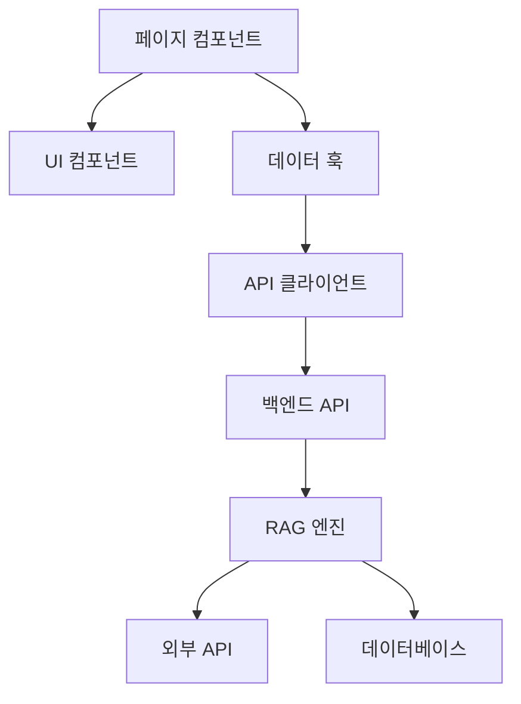

# KeywordPulse 프로젝트 구조

## 개요

KeywordPulse는 Next.js 기반의, 키워드 분석 및 트렌드 파악을 위한 웹 애플리케이션입니다. 이 문서는 프로젝트의 디렉토리 구조와 주요 컴포넌트, 파일의 역할을 설명합니다.

## 디렉토리 구조

```
keywordpulse/
├── app/                 # Next.js App Router 구조
│   ├── api/             # API 라우트 (서버 API 엔드포인트)
│   ├── components/      # 앱 전용 컴포넌트
│   ├── lib/             # 앱 전용 라이브러리 코드
│   ├── [routes]/        # 각 페이지 라우트
│   ├── layout.tsx       # 루트 레이아웃
│   └── page.tsx         # 인덱스 페이지
├── components/          # 공통 컴포넌트
├── hooks/               # 커스텀 React 훅
├── lib/                 # 공유 라이브러리 코드
├── public/              # 정적 파일 (이미지 등)
├── scripts/             # 유틸리티 스크립트
├── tests/               # 테스트 코드
├── Docs/                # 프로젝트 문서
├── .next/               # Next.js 빌드 출력 (git ignore)
├── node_modules/        # 노드 모듈 (git ignore)
├── .env.local           # 환경 변수 (git ignore)
├── next.config.js       # Next.js 구성
├── package.json         # 프로젝트 정보 및 의존성
└── tsconfig.json        # TypeScript 구성
```

## 주요 디렉토리 설명

### `/app`

Next.js 13 이상의 App Router 구조를 사용합니다. 각 폴더는 라우트 경로를 정의하며, 내부의 `page.tsx` 파일이 해당 경로의 페이지 컴포넌트가 됩니다.

```
app/
├── api/                 # 서버 API 엔드포인트
│   ├── analyze/         # 키워드 분석 API
│   ├── feedback/        # 사용자 피드백 API
│   ├── metrics/         # 성능 지표 API
│   ├── notify/          # 알림 관련 API
│   │   ├── telegram/    # 텔레그램 알림 API
│   │   └── ...
│   ├── search/          # 검색 API
│   ├── trend/           # 트렌드 분석 API
│   └── ...
├── auth/                # 인증 관련 페이지
├── admin/               # 관리자 페이지
├── components/          # 앱 전용 컴포넌트
├── help/                # 도움말 페이지
├── lib/                 # 앱 전용 라이브러리
├── profile/             # 사용자 프로필 페이지
└── trends/              # 트렌드 분석 페이지
```

### `/components`

재사용 가능한 UI 컴포넌트가 위치합니다. 폴더 구조는 기능과 UI 영역으로 구분되어 있습니다.

```
components/
├── ui/                  # 기본 UI 컴포넌트
│   ├── button.tsx
│   ├── card.tsx
│   ├── input.tsx
│   └── ...
├── layout/              # 레이아웃 컴포넌트
│   ├── Header.tsx
│   ├── Footer.tsx
│   ├── Sidebar.tsx
│   └── ...
├── charts/              # 데이터 시각화 컴포넌트
├── forms/               # 폼 관련 컴포넌트
└── keyword/             # 키워드 분석 관련 컴포넌트
```

### `/lib`

애플리케이션 전반에서 사용되는 유틸리티 함수, 서비스, 모듈을 포함합니다.

```
lib/
├── analytics.ts         # 분석 관련 유틸리티
├── errors.ts            # 오류 처리 클래스
├── exceptions.ts        # 예외 처리 클래스
├── logger.ts            # 로깅 유틸리티
├── rag_engine.ts        # RAG 검색 엔진
├── rag-integration.ts   # RAG 통합 모듈
├── supabaseClient.ts    # Supabase 클라이언트
├── telegram.ts          # 텔레그램 API 유틸리티
└── trends_api.ts        # 트렌드 데이터 API 클라이언트
```

### `/hooks`

React 커스텀 훅을 포함합니다.

```
hooks/
├── useAuth.ts           # 인증 관련 훅
├── useDebounce.ts       # 디바운스 기능 훅
├── useFetch.ts          # 데이터 페칭 훅
├── useKeywordAnalysis.ts # 키워드 분석 훅
└── useLocalStorage.ts   # 로컬 스토리지 관리 훅
```

## 주요 파일 설명

### 구성 파일

- **next.config.js**: Next.js 설정 파일로, 환경 변수, 웹팩 설정, 이미지 최적화 옵션 등을 포함
- **tsconfig.json**: TypeScript 설정 파일
- **vercel.json**: Vercel 배포 구성 파일
- **.vercelignore**: Vercel 배포 시 제외할 파일 목록
- **package.json**: 프로젝트 메타데이터 및 의존성 목록

### 핵심 애플리케이션 파일

- **app/layout.tsx**: 전체 애플리케이션의 기본 레이아웃
- **app/page.tsx**: 메인 랜딩 페이지
- **app/api/**/route.ts**: 서버 API 엔드포인트 구현
- **lib/rag_engine.ts**: RAG 검색 엔진 구현
- **lib/trends_api.ts**: 트렌드 데이터 API 통합

## 모듈 의존성 다이어그램



## 코드 구성 패턴

### 페이지 컴포넌트

```typescript
// app/trends/page.tsx 예제
export default function TrendsPage() {
  // 데이터 페칭 및 상태 관리
  const { data, isLoading, error } = useTrendData();
  
  // 로딩 및 오류 처리
  if (isLoading) return <Loading />;
  if (error) return <ErrorComponent message={error.message} />;
  
  // 페이지 렌더링
  return (
    <Layout>
      <TrendHeader title="트렌드 분석" />
      <TrendDashboard data={data} />
    </Layout>
  );
}
```

### API 라우트

```typescript
// app/api/trend/route.ts 예제
import { NextRequest, NextResponse } from 'next/server';
import { fetchTrendData } from '@/lib/trends_api';

export async function GET(request: NextRequest) {
  try {
    // 쿼리 파라미터 추출
    const { searchParams } = new URL(request.url);
    const category = searchParams.get('category') || 'all';
    
    // 데이터 처리
    const data = await fetchTrendData(category);
    
    // 응답 반환
    return NextResponse.json({ success: true, data });
  } catch (error) {
    // 오류 처리
    return NextResponse.json(
      { success: false, message: error.message },
      { status: 500 }
    );
  }
}
```

### 커스텀 훅

```typescript
// hooks/useKeywordAnalysis.ts 예제
import { useState, useEffect } from 'react';
import { analyzeKeyword } from '@/lib/rag-integration';

export function useKeywordAnalysis(keyword: string) {
  const [data, setData] = useState(null);
  const [isLoading, setIsLoading] = useState(false);
  const [error, setError] = useState(null);
  
  useEffect(() => {
    if (!keyword) return;
    
    const fetchData = async () => {
      setIsLoading(true);
      setError(null);
      
      try {
        const result = await analyzeKeyword(keyword);
        setData(result);
      } catch (err) {
        setError(err);
      } finally {
        setIsLoading(false);
      }
    };
    
    fetchData();
  }, [keyword]);
  
  return { data, isLoading, error };
}
```

## 환경 설정

프로젝트는 다음 환경 변수를 활용합니다:

```
# .env.local 예제
NEXT_PUBLIC_SUPABASE_URL=<Supabase URL>
NEXT_PUBLIC_SUPABASE_ANON_KEY=<Supabase Anon Key>
TELEGRAM_BOT_TOKEN=<Telegram Bot Token>
TELEGRAM_CHAT_ID=<Telegram Chat ID>
OPENAI_API_KEY=<OpenAI API Key>
```

## 배포 구조

프로젝트는 Vercel 플랫폼에 배포되며, 다음과 같은 구조로 실행됩니다:

1. **프론트엔드**: Next.js 정적/서버 렌더링 페이지
2. **API**: Next.js API 라우트 (서버리스 함수)
3. **데이터베이스**: Supabase (PostgreSQL)
4. **이미지 저장소**: Vercel Blob Storage
5. **인증**: Supabase Auth

## 데이터 흐름

1. 사용자가 UI에서 작업 수행
2. 프론트엔드 컴포넌트가 커스텀 훅을 통해 데이터 요청
3. 훅이 내부 API 엔드포인트 호출
4. API 엔드포인트가 필요한 서비스 호출 (RAG 엔진, 외부 API 등)
5. 데이터 변환 및 처리 후 응답 반환
6. UI 업데이트

## 추가 참고사항

- **타입 시스템**: 프로젝트 전체에 TypeScript를 사용하여 정적 타입 검사
- **스타일링**: Tailwind CSS를 주로 사용하며, 컴포넌트 스타일링에 적용
- **상태 관리**: 복잡한 전역 상태는 React Context API로 관리
- **모듈 가져오기**: 절대 경로 임포트 (@/components, @/lib 등)를 사용 