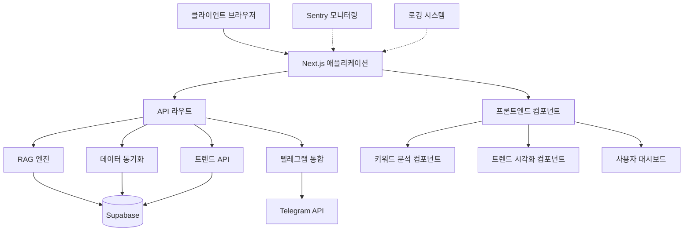

# KeywordPulse 참조 아키텍처

이 문서는 KeywordPulse 프로젝트의 전체 시스템 아키텍처를 설명합니다. 현재 코드베이스의 구조, 상호 의존성, 주요 컴포넌트와 그들 간의 상호 작용을 이해하는 데 도움이 됩니다.

## 1. 시스템 개요

KeywordPulse는 실시간 키워드 분석과 트렌드를 시각화하는 웹 애플리케이션입니다. 사용자는 키워드 분석, 트렌드 모니터링, 시각화 도구 등을 활용하여 콘텐츠 전략을 수립할 수 있습니다.

### 1.1 핵심 기능

- 키워드 분석 및 점수화
- 트렌드 모니터링 및 시각화
- 텔레그램 알림 통합
- 사용자 인증 및 권한 관리
- 데이터 동기화 및 저장

## 2. 기술 스택

### 2.1 프론트엔드
- **프레임워크**: Next.js 14.0.3 (App Router)
- **UI 라이브러리**: React 18, TailwindCSS
- **상태 관리**: React Context API
- **데이터 시각화**: Chart.js, react-chartjs-2
- **인증**: Supabase Auth

### 2.2 백엔드
- **API 서버**: Next.js API Routes (서버리스)
- **데이터베이스**: Supabase (PostgreSQL)
- **분석 엔진**: 자체 개발 RAG 엔진
- **외부 통합**: Telegram API

### 2.3 인프라
- **배포**: Vercel (정적 사이트 생성 + 서버리스 함수)
- **모니터링**: Sentry
- **로깅**: 자체 로깅 시스템
- **버전 관리**: Git

## 3. 시스템 아키텍처



## 4. 코드 구조

### 4.1 디렉토리 구조

```
keywordpulse/
├── app/                    # Next.js App Router
│   ├── api/                # API 라우트
│   │   ├── analyze/        # 키워드 분석 API
│   │   ├── metrics/        # 분석 지표 API
│   │   ├── notify/         # 알림 API
│   │   ├── related/        # 관련 키워드 API
│   │   ├── search/         # 검색 API
│   │   ├── sync/           # 데이터 동기화 API
│   │   ├── track/          # 사용자 행동 추적 API
│   │   ├── trend/          # 키워드 트렌드 API
│   │   └── trending/       # 인기 키워드 API
│   ├── app/                # 메인 애플리케이션 라우트
│   │   ├── admin/          # 관리자 페이지
│   │   ├── auth/           # 인증 관련 페이지
│   │   ├── contact/        # 연락처 페이지
│   │   ├── docs/           # 문서 페이지
│   │   ├── help/           # 도움말 페이지
│   │   ├── login/          # 로그인 페이지
│   │   ├── pricing/        # 가격 페이지
│   │   ├── privacy/        # 개인정보처리방침 페이지
│   │   ├── profile/        # 사용자 프로필 페이지
│   │   └── terms/          # 이용약관 페이지
│   ├── components/         # 공통 컴포넌트
│   │   ├── KeywordCloud/   # 키워드 클라우드 컴포넌트
│   │   ├── TrendChart/     # 트렌드 차트 컴포넌트
│   │   └── ...
│   ├── hooks/              # 커스텀 훅
│   │   ├── useKeywordScoreBadge/  # 키워드 점수 배지 훅
│   │   └── ...
│   ├── lib/                # 유틸리티 및 라이브러리
│   │   ├── analytics.ts    # 분석 유틸리티
│   │   ├── logger.ts       # 로깅 유틸리티
│   │   ├── rag_engine.ts   # RAG 엔진
│   │   ├── supabaseClient.ts # Supabase 클라이언트
│   │   ├── telegram.ts     # 텔레그램 통합
│   │   └── trends_api.ts   # 트렌드 API 유틸리티
│   ├── trends/             # 트렌드 페이지
│   │   ├── page.tsx        # 트렌드 페이지
│   │   └── TrendDashboard.tsx # 트렌드 대시보드 컴포넌트
│   └── ...
├── Docs/                   # 프로젝트 문서
│   ├── libwys_Keywordpulse Wbs Plan.md  # WBS 계획
│   ├── ReferenceArchitecture.md  # 아키텍처 문서 (현재 문서)
│   └── ...
├── scripts/                # 유틸리티 스크립트
├── tests/                  # 테스트
└── ...
```

### 4.2 주요 모듈

#### 4.2.1 프론트엔드 컴포넌트

- **TrendDashboard**: 트렌드 시각화 대시보드
- **KeywordCloud**: 관련 키워드 클라우드 시각화
- **TrendChart**: 키워드 트렌드 차트 시각화

#### 4.2.2 백엔드 모듈

- **RAG 엔진**: 키워드 분석 및 점수화를 위한 엔진
- **Trends API**: 키워드 트렌드 데이터 관리 및 제공
- **Telegram 통합**: 알림 및 메시지 전송

#### 4.2.3 유틸리티 모듈

- **Logger**: 로깅 시스템
- **Analytics**: 사용자 분석 및 지표 수집
- **SupabaseClient**: Supabase 통합

## 5. 주요 데이터 흐름

### 5.1 키워드 분석 흐름

1. 사용자가 키워드 분석 요청
2. API 라우트가 요청을 RAG 엔진으로 전달
3. RAG 엔진이 키워드 분석 및 점수화 수행
4. 결과를 사용자에게 반환하고 Supabase에 저장
5. 필요 시 Telegram으로 알림 전송

### 5.2 트렌드 시각화 흐름

1. 사용자가 트렌드 대시보드 접속
2. 트렌드 API에서 인기 키워드 및 관련 데이터 로드
3. TrendChart와 KeywordCloud 컴포넌트가 데이터 시각화
4. 사용자는 카테고리 필터 및 키워드 선택 가능
5. 선택된 키워드에 따라 트렌드 차트 및 관련 키워드 업데이트

## 6. 통합 및 확장성

### 6.1 외부 시스템 통합

- **Supabase**: 인증 및 데이터 저장
- **Telegram**: 알림 및 메시지 전송
- **Sentry**: 오류 모니터링 및 보고
- **Vercel**: 배포 및 호스팅

### 6.2 확장성 고려사항

- **모듈식 구조**: 개별 기능은 독립된 모듈로 분리
- **API 추상화**: 외부 서비스는 추상화된 인터페이스로 접근
- **캐싱 전략**: 성능 최적화를 위한 데이터 캐싱 적용
- **확장 계획**: 사용자 피드백 시스템, 추가 시각화 도구, 경로 관리 자동화

## 7. 성능 및 보안 고려사항

### 7.1 성능 최적화

- **정적 생성**: 가능한 페이지는 정적으로 생성하여 성능 최적화
- **코드 분할**: 필요한 코드만 로드하여 초기 로딩 시간 단축
- **메모이제이션**: 불필요한 계산 방지

### 7.2 보안 고려사항

- **인증 보안**: Supabase를 통한 안전한 인증
- **API 보호**: API 라우트 접근 제어
- **CORS 정책**: 적절한 CORS 설정
- **데이터 검증**: 입력 데이터 검증 및 필터링

## 8. 향후 로드맵

### 8.1 단기 계획

- **경로 관리 자동화**: 파일 경로 및 임포트 구조 표준화
- **사용자 피드백 시스템**: 사용자 피드백 수집 및 분석

### 8.2 중기 계획

- **AI 기반 인사이트**: 키워드 분석에 AI 기반 인사이트 추가
- **추가 시각화 도구**: 더 다양한 데이터 시각화 도구 개발
- **성능 최적화**: 코드 및 데이터 처리 최적화

### 8.3 장기 계획

- **실시간 트렌드 분석**: 실시간 데이터 처리 및 분석
- **커스텀 대시보드**: 사용자 맞춤형 대시보드 기능
- **다국어 지원**: 다양한 언어 및 지역 지원 확장 