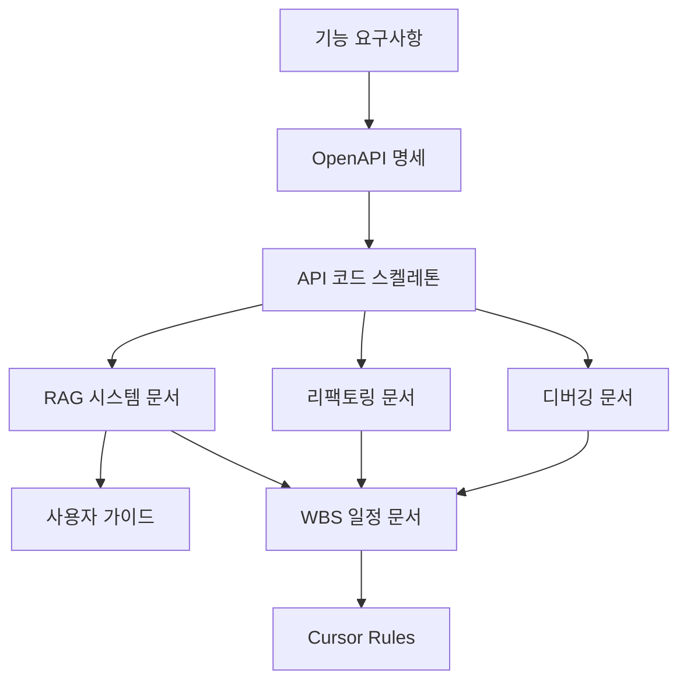

# 🔗 KeywordPulse 참조 문서 (문서 및 코드 간 유기적 연결)

이 문서는 KeywordPulse 프로젝트 내 모든 문서, 코드, 모듈, API, 기능 간의 유기적 연결 구조와 참조 흐름을 관리합니다. 전체 개발과정에서 문서 기반 개발이 실현될 수 있도록 도메인별 역할을 정리하고, **Cursor Rules**, **WBS**, **리팩토링**, **RAG**, **디버깅** 문서와 상호 참조합니다.

---

## 📚 핵심 문서 역할 및 참조 흐름

| 문서 | 도메인 역할 | 주요 참조 대상 |
|------|--------------|----------------|
| `기능 요구사항` | 전체 시스템 정의, 비즈니스 목표 설명 | 모든 기술 문서의 기준 문서 |
| `UI/UX 디자인` | 사용자 인터페이스 구조, 컴포넌트 명세 | 프론트 코드, Figma 설계 문서 |
| `OpenAPI 명세` | API 계약 및 요청/응답 구조 정의 | 백엔드 코드, API 스켈레톤 |
| `서버리스 스켈레톤` | 실제 API 함수 베이스 코드 구조 | OpenAPI, RAG, WBS 참조 |
| `Vercel 설정` | 배포 및 실행 환경 구성 | 서버리스 스켈레톤 연계 |
| `Supabase 인증` | 인증 흐름 및 RLS 정책 | API 보호 로직, 사용자 구분 |
| `Figma 와이어프레임` | 화면 배치 및 사용자 흐름 시각화 | UI/UX 문서, 컴포넌트 설계 참조 |
| `테스트 전략` | QA 항목 및 자동화 흐름 | WBS 일정, 리팩토링 기준 반영 |
| `운영/모니터링` | 로그, 성능, Sentry 구성 | 배포 및 실서비스 유지에 필수 |
| `릴리즈 노트` | 릴리즈 기준, 체크리스트 관리 | GitHub Tag 기준 문서화 |
| `사용자 가이드` | 사용자 매뉴얼, 기능별 설명 | UI 구성 참조, 분석 결과 해석 지원 |
| `SEO / 메타 구성` | 검색엔진 최적화 구성 | Layout.tsx, sitemap.xml, robots.txt 참조 |
| `RAG 시스템 문서` | 분석 텍스트 생성 로직 중심 | API `/analyze`, 리팩토링 기준 |
| `리팩토링 전략` | 코드 품질 및 유지보수 기준 | 전체 API/프론트 구조 설계 기준 |
| `WBS 계획표` | 전체 일정 및 의존성 기준 | 모든 구현 일정과 기능 흐름 기준 |
| `디버깅 문서` | 오류 패턴 및 예외 케이스 기록 | 리팩토링, 테스트 항목 반복 점검용 |
| `Cursor Rules 문서` | 전체 프로젝트 룰 및 자동화 기준 | 모든 문서 참조 대상, CLI 기반 자동화용 |

---

## 🔁 문서 간 참조 구조 흐름도

---

## 📌 실제 코드와 문서 간 연결 예시

| 코드 위치 | 참조 문서 |
|------------|-----------|
| `api/analyze.py` | RAG 문서, OpenAPI 명세, 리팩토링 문서 |
| `components/KeywordTable.tsx` | UI/UX 디자인 문서, 리팩토링 문서 |
| `auth/token_verifier.py` | Supabase 인증 문서, OpenAPI 보안 스키마 |
| `tests/test_notify.py` | 디버깅 문서, 테스트 전략 문서 |
| `lib/rag_engine.py` | RAG 시스템 문서, 리팩토링 전략 |

---

## 🧩 연결 기준 및 관리 규칙

- 모든 문서 및 모듈은 고유 ID(`WBS-ID`, `API-ID`) 또는 문서명 기반 참조
- 리팩토링, 디버깅, RAG 변경 시 반드시 WBS 반영
- `Cursor Rules` 문서 내 참조 섹션에 반영되어야 CLI 자동화 대응 가능

---