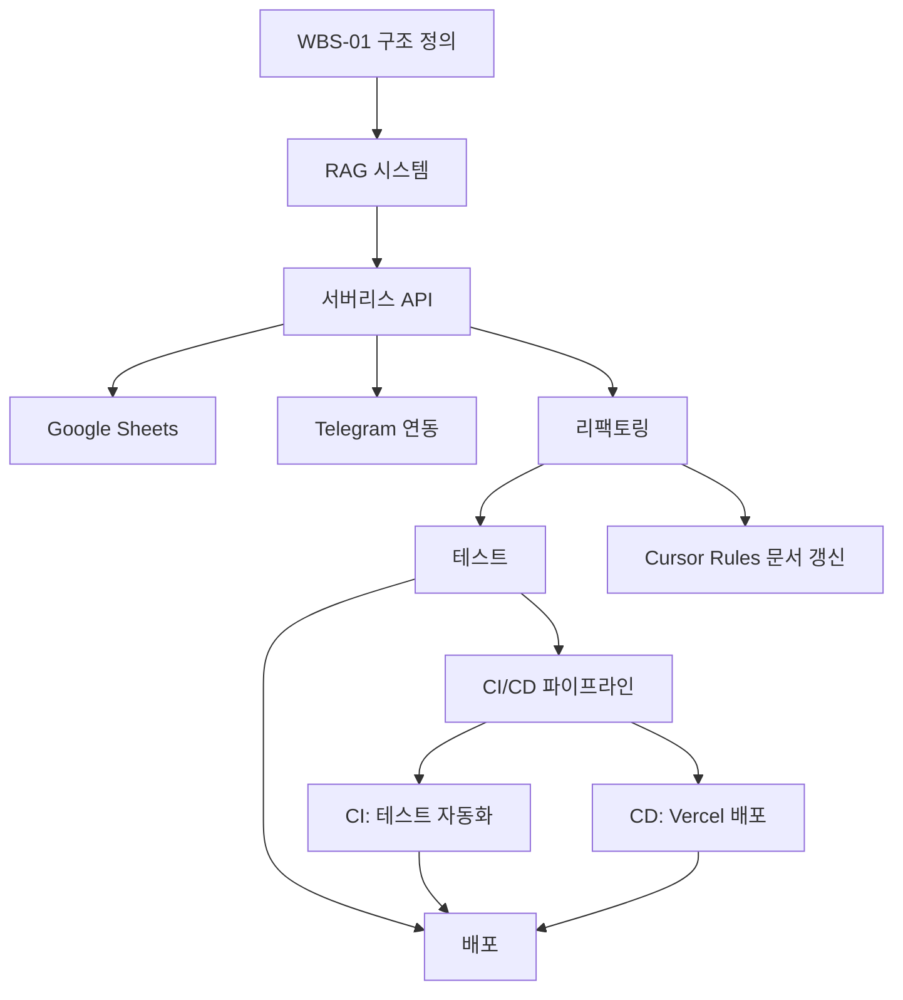

# 📆 KeywordPulse 프로젝트 WBS (Work Breakdown Structure)

이 문서는 KeywordPulse 프로젝트의 전체 작업 일정, 작업 단위, 담당 영역, 상호 의존성을 기준으로 구성된 일정/계획 문서입니다. 개발 진척 상황에 따라 반복적으로 업데이트되며, **RAG, 리팩토링, 디버깅 문서** 및 **Cursor Rules**와 연동됩니다.

---

## 🎯 목적

- 기능 중심 개발 작업 분해
- 일정 추적 및 우선순위 설정
- 리팩토링 및 디버깅 문서 기준으로 지속적 최신화

---

## 🗂️ 주요 WBS 항목 요약

| WBS ID | 작업 항목               | 담당     | 기간           | 상태     |
| ------ | ------------------- | ------ | ------------ | ------ |
| WBS-01 | 프로젝트 구조 정의 및 문서화    | 기획팀    | 4/20 \~ 4/21 | ✅ 완료   |
| WBS-02 | RAG 시스템 템플릿 구조 구현   | AI팀    | 4/21 \~ 4/22 | ✅ 완료   |
| WBS-03 | FastAPI 서버리스 함수화    | 백엔드    | 4/22 \~ 4/24 | ✅ 완료 |
| WBS-04 | 프론트엔드 Next.js UI 제작 | 프론트    | 4/23 \~ 4/26 | ✅ 완료 |
| WBS-05 | Supabase Auth 통합    | 공통     | 4/24 \~ 4/25 | ✅ 완료 |
| WBS-06 | Google Sheets 연동    | 백엔드    | 4/25 \~ 4/26 | ✅ 완료  |
| WBS-07 | Telegram API 연동     | 백엔드    | 4/25 \~ 4/26 | ✅ 완료  |
| WBS-08 | RAG + API 통합 테스트    | QA팀    | 4/26 \~ 4/27 | ✅ 완료 |
| WBS-09 | 리팩토링 (공통 기준 반영)     | 전팀     | 4/27 \~ 4/28 | ✅ 완료 |
| WBS-10 | SEO, 배포, 메타 구성      | DevOps | 4/28 \~ 4/29 | ✅ 완료  |
| WBS-11 | 자동화 테스트 / CI 연동     | QA팀    | 4/29 \~ 5/07 | ✅ 완료  |
| WBS-12 | 운영 로그, Sentry 분석   | 운영팀    | 5/08 \~ 5/09 | ✅ 완료  |
| WBS-13 | 릴리즈 및 최종 배포         | 전체     | 5/10         | ⏳ 진행 중  |

---

## 🧩 의존 관계 흐름도

---

## 🔁 업데이트 규칙

- RAG 템플릿 변경 시 `WBS-02`, `WBS-09`, `WBS-08` 연동 일정 수정 필요
- 리팩토링 문서 기준으로 WBS-09 세부 항목 지속 업데이트
- 디버깅 문서 참조로 `WBS-08`, `WBS-11` 테스트 항목 재설계 가능
- **Cursor Rules 문서**에서 명시된 룰 기반으로 WBS 자동 반영

---

## 📌 참고 문서 연동

| 문서           | 참조 항목                 |
| ------------ | --------------------- |
| RAG 시스템 문서   | WBS-02, WBS-08        |
| 리팩토링 전략      | WBS-09                |
| 디버깅 문서       | WBS-11, WBS-08        |
| CI/CD 구성 가이드 | WBS-11                |
| 로깅 및 모니터링 전략 | WBS-12                |
| 참조 연결 문서     | 전체 흐름 간 관계 이해         |
| Cursor Rules | 일정 최신화 및 코드 품질 가이드 반영 |

---

## 📊 현재 진행 상황 (2023.05.10 업데이트)

### ✅ 완료된 항목
- 프로젝트 기본 구조 정립 및 문서화 완료
- RAG 템플릿 시스템 구현 및 `lib/rag_engine.py`로 분리
- FastAPI 서버리스 함수 구현 (`/api/search`, `/api/analyze`, `/api/sync`, `/api/notify`)
- 프론트엔드 기본 컴포넌트 개발 (ActionButtons, AnalysisCard, KeywordTable)
- Google Sheets 및 Telegram API 연동 기능 구현
- Supabase Auth 통합 (로그인/회원가입, 프로필 페이지, AuthContext 구현)
- API 모듈화 및 코드 리팩토링 완료
- RAG 시스템 및 API 통합 테스트 구현 및 실행
- SEO 메타데이터 설정 및 OG 태그 구성 완료
  - 공통 메타데이터 시스템 구축
  - 페이지별 메타데이터 최적화
  - sitemap.xml, robots.txt, manifest.json 생성
  - 구조화된 데이터(JSON-LD) 추가
- CI/CD 관련 문서화 및 설정 완료
  - CI/CD 구성 가이드 문서 작성 및 업데이트
  - GitHub Actions 워크플로우 파일 구성
  - Vercel 배포 설정(vercel.json) 추가
  - 배포 방식을 GitHub Actions에서 Vercel Git 통합으로 변경
  - 테스트 자동화 기반 코드 작성
  - CI 파이프라인 오류 해결
    - 의존성 캐싱 관련 설정 제거
    - 기본 테스트 파일 추가
    - 에러 복구 로직 구현
- 모니터링 시스템 및 에러 로깅 구현
  - Sentry 통합 완료
  - ErrorBoundary 컴포넌트 구현
  - 로깅 시스템 구축 (lib/logger.ts)
  - 클라이언트 및 서버 측 Sentry 설정 구성
- 패키지 의존성 문제 해결
  - 패키지 버전 고정 및 최적화
  - 불필요한 의존성 제거

### ⏳ 진행 중인 항목
- **Vercel 배포 준비** (80% 완료)
  - 환경 변수 구성 완료
  - 로컬 빌드 테스트 성공
  - Vercel 프로젝트 설정 진행 중
- **최종 릴리즈 준비** (50% 완료)
  - 최종 릴리즈 체크리스트 작성 완료
  - 기능 검증 진행 중
  - 성능 및 보안 검증 진행 중

### 🚀 다음 단계
- **Vercel 프로젝트 설정 완료** (우선 순위 높음)
  - Vercel 대시보드에서 프로젝트 설정 마무리
  - GitHub 저장소 연결 및 배포 트리거
  - 배포 후 기능 검증
- **최종 릴리즈 체크리스트 완료**
  - 모든 기능 검증 항목 확인
  - 기술적 검증 항목 확인
  - 문서화 항목 확인
- **사용자 피드백 수집 준비**
  - 피드백 양식 추가
  - 사용자 경험 모니터링 설정