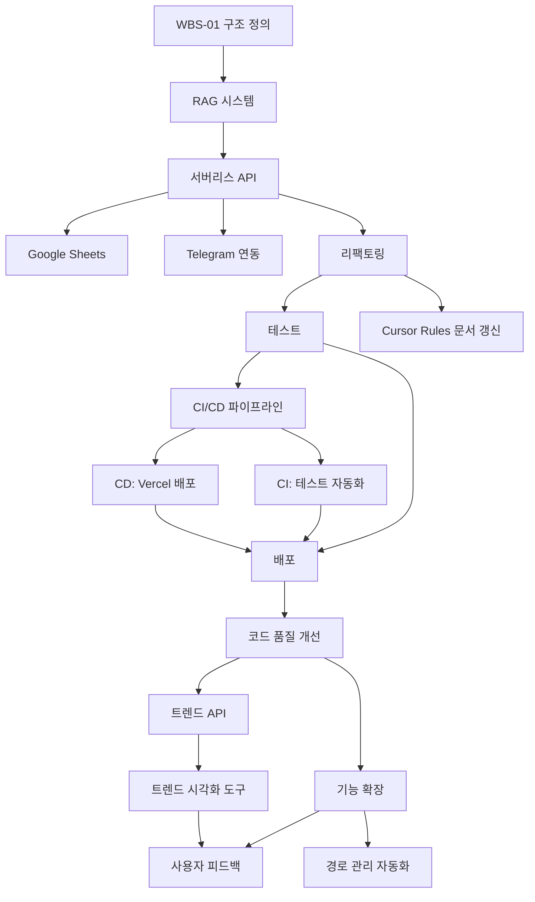

# 📆 KeywordPulse 프로젝트 WBS (Work Breakdown Structure)

이 문서는 KeywordPulse 프로젝트의 전체 작업 일정, 작업 단위, 담당 영역, 상호 의존성을 기준으로 구성된 일정/계획 문서입니다. 개발 진척 상황에 따라 반복적으로 업데이트되며, **RAG, 리팩토링, 디버깅 문서** 및 **Cursor Rules**와 연동됩니다.

---

## 🎯 목적

- 기능 중심 개발 작업 분해
- 일정 추적 및 우선순위 설정
- 리팩토링 및 디버깅 문서 기준으로 지속적 최신화

---

## 🗂️ 주요 WBS 항목 요약

| WBS ID | 작업 항목               | 담당     | 기간           | 상태     |
| ------ | ------------------- | ------ | ------------ | ------ |
| WBS-01 | 프로젝트 구조 정의 및 문서화    | 기획팀    | 4/20 \~ 4/21 | ✅ 완료   |
| WBS-02 | RAG 시스템 템플릿 구조 구현   | AI팀    | 4/21 \~ 4/22 | ✅ 완료   |
| WBS-03 | FastAPI 서버리스 함수화    | 백엔드    | 4/22 \~ 4/24 | ✅ 완료 |
| WBS-04 | 프론트엔드 Next.js UI 제작 | 프론트    | 4/23 \~ 4/26 | ✅ 완료 |
| WBS-05 | Supabase Auth 통합    | 공통     | 4/24 \~ 4/25 | ✅ 완료 |
| WBS-06 | Google Sheets 연동    | 백엔드    | 4/25 \~ 4/26 | ✅ 완료  |
| WBS-07 | Telegram API 연동     | 백엔드    | 4/25 \~ 4/26 | ✅ 완료  |
| WBS-08 | RAG + API 통합 테스트    | QA팀    | 4/26 \~ 4/27 | ✅ 완료 |
| WBS-09 | 리팩토링 (공통 기준 반영)     | 전팀     | 4/27 \~ 4/28 | ✅ 완료 |
| WBS-10 | SEO, 배포, 메타 구성      | DevOps | 4/28 \~ 4/29 | ✅ 완료  |
| WBS-11 | 자동화 테스트 / CI 연동     | QA팀    | 4/29 \~ 5/07 | ✅ 완료  |
| WBS-12 | 운영 로그, Sentry 분석   | 운영팀    | 5/08 \~ 5/09 | ✅ 완료  |
| WBS-13 | 릴리즈 및 최종 배포         | 전체     | 5/10         | ✅ 완료  |
| WBS-14 | 코드 품질 개선 및 기능 확장   | 개발팀    | 5/11 \~ 5/27 | ✅ 완료 |
| WBS-15 | 트렌드 API 개선 및 확장    | 백엔드    | 5/21 \~ 5/25 | ✅ 완료 |
| WBS-16 | 트렌드 시각화 도구 개발     | 프론트    | 5/27 \~ 6/05 | ✅ 완료   |
| WBS-17 | 경로 관리 자동화 및 구조 개선 | 개발팀    | 6/03 \~ 6/10 | ✅ 완료   |
| WBS-18 | 사용자 피드백 수집 및 반영   | 기획/UX   | 6/05 \~ 6/15 | 진행중(20%) |

---

## 🧩 의존 관계 흐름도

---

## 🔁 업데이트 규칙

- RAG 템플릿 변경 시 `WBS-02`, `WBS-09`, `WBS-08` 연동 일정 수정 필요
- 리팩토링 문서 기준으로 WBS-09 세부 항목 지속 업데이트
- 디버깅 문서 참조로 `WBS-08`, `WBS-11` 테스트 항목 재설계 가능
- **Cursor Rules 문서**에서 명시된 룰 기반으로 WBS 자동 반영

---

## 📌 참고 문서 연동

| 문서           | 참조 항목                 |
| ------------ | --------------------- |
| RAG 시스템 문서   | WBS-02, WBS-08, WBS-14 |
| 리팩토링 전략      | WBS-09, WBS-14        |
| 디버깅 문서       | WBS-11, WBS-08        |
| CI/CD 구성 가이드 | WBS-11                |
| 로깅 및 모니터링 전략 | WBS-12                |
| 참조 연결 문서     | 전체 흐름 간 관계 이해         |
| Cursor Rules | 일정 최신화 및 코드 품질 가이드 반영 |
| 경로 관리 가이드     | WBS-17                |

---

## 📊 현재 진행 상황 (2023.06.10 업데이트)

### ✅ 완료된 항목
- 프로젝트 기본 구조 정립 및 문서화 완료
- RAG 템플릿 시스템 구현 및 `lib/rag_engine.py`로 분리
- FastAPI 서버리스 함수 구현 (`/api/search`, `/api/analyze`, `/api/sync`, `/api/notify`)
- 프론트엔드 기본 컴포넌트 개발 (ActionButtons, AnalysisCard, KeywordTable)
- Google Sheets 및 Telegram API 연동 기능 구현
- Supabase Auth 통합 (로그인/회원가입, 프로필 페이지, AuthContext 구현)
- API 모듈화 및 코드 리팩토링 완료
- RAG 시스템 및 API 통합 테스트 구현 및 실행
- SEO 메타데이터 설정 및 OG 태그 구성 완료
  - 공통 메타데이터 시스템 구축
  - 페이지별 메타데이터 최적화
  - sitemap.xml, robots.txt, manifest.json 생성
  - 구조화된 데이터(JSON-LD) 추가
- CI/CD 관련 문서화 및 설정 완료
  - CI/CD 구성 가이드 문서 작성 및 업데이트
  - GitHub Actions 워크플로우 파일 구성
  - Vercel 배포 설정(vercel.json) 추가
  - 배포 방식을 GitHub Actions에서 Vercel Git 통합으로 변경
  - 테스트 자동화 기반 코드 작성
  - CI 파이프라인 오류 해결
- 모니터링 시스템 및 에러 로깅 구현
  - Sentry 통합 완료
  - ErrorBoundary 컴포넌트 구현
  - 로깅 시스템 구축 (lib/logger.ts)
  - 클라이언트 및 서버 측 Sentry 설정 구성
- 패키지 의존성 문제 해결
  - 패키지 버전 고정 및 최적화
  - 불필요한 의존성 제거
- Vercel 배포 준비 및 환경 구성 완료
  - 환경 변수 구성 완료
  - 로컬 빌드 테스트 성공
  - Vercel 프로젝트 설정 완료
  - 배포 자동화 구성 완료
- 최종 릴리즈 준비 완료
  - 최종 릴리즈 체크리스트 검증 완료
  - 기능 및 성능 검증 완료
  - 보안 검증 완료
- **Next.js 프로젝트 구조 및 경로 문제 해결** ✅
  - 삭제된 훅 파일 재생성 및 검증
  - tsconfig.json 경로 별칭 설정 수정
  - 레이아웃 구조 오류 수정 (app/privacy, app/terms 레이아웃 추가)
  - Next.js 빌드 캐시 클리어 및 재빌드
  - 디버깅 가이드 문서에 경로 문제 해결 방법 추가
  - **Import 경로 표준화** ✅
    - 상대 경로를 절대 경로(@/)로 일관되게 변경
    - 훅 파일을 루트 hooks 디렉토리로 복사하여 접근성 개선
    - Vercel 배포 문제 해결
- **트렌드 API 개선 및 확장** ✅
  - `trends_api.ts` 모듈 리팩토링 및 코드 최적화
  - 캐싱 메커니즘 구현으로 API 응답 성능 개선
  - 카테고리별 데이터 상수화 및 정리
  - 트렌딩 키워드 API 엔드포인트 구현 (`/api/trending`)
  - 관련 키워드 API 엔드포인트 구현 (`/api/related`)
  - 키워드 트렌드 API 엔드포인트 구현 (`/api/trend`)
  - API 응답 형식 표준화 및 에러 처리 강화
  - 로깅 시스템 통합으로 API 모니터링 개선
- **코드 리팩토링 및 기능 개선** ✅
  - **RAG 엔진 모듈화 및 성능 개선** ✅
    - analyze API에서 로직 분리 및 `rag_engine.ts` 파일 생성
    - 카테고리별 분석 함수 각각 분리
    - 로깅 개선 및 오류 처리 통합
    - 성능 최적화: 캐싱 및 메모이제이션 적용
  - **UI 컴포넌트 개선 및 리팩토링** ✅
    - `useKeywordScoreBadge` 훅 리팩토링 완료
    - `AnalysisRenderer` 컴포넌트 스타일 및 접근성 개선
    - 키워드 배지 색상 및 등급 세분화
    - `KeywordTable` 컴포넌트 정렬 로직 분리 완료
    - `AnalysisCard` 컴포넌트에 접기/펼치기 기능 추가
    - 복사 상태 시각적 피드백 개선
  - **패키지 의존성 정리 및 코드 최적화** ✅
    - 중복 로직 제거
    - 컴포넌트 재사용성 향상
    - 타입 정의 개선
    - 경로 구조 표준화
- **트렌드 시각화 도구 개발 (WBS-16)** ✅
  - **트렌드 차트 컴포넌트 개발** ✅
    - 일간/주간/월간 트렌드 시각화 구현
    - 반응형 디자인 최적화
    - 데이터 로딩 상태 표시 개선
    - 차트 색상 및 스타일 조정
    - 애니메이션 효과 추가
  - **관련 키워드 클라우드 컴포넌트 개발** ✅
    - 인터랙티브 키워드 클라우드 구현
    - 반응형 디자인 구현
    - 데이터 로딩 상태 관리
    - 애니메이션 효과 적용
  - **트렌드 대시보드 통합 작업** ✅
    - 트렌드 API 연동
    - 카테고리 필터링 구현
    - 키워드 선택 로직 구현
    - 데이터 캐싱 적용
    - 트렌드 페이지 구현
  - **카테고리별 인사이트 대시보드** ✅
    - 카테고리별 트렌드 분석 UI 개발
    - 인사이트 자동 생성 로직 구현
- **경로 관리 자동화 및 구조 개선 (WBS-17)** (✅ 완료)
  - **경로 참조 검증 스크립트 개발** (✅ 완료)
    - 중복 app 디렉토리 구조 검증 기능 구현
    - 일관되지 않은 import 경로 감지 기능 구현
    - 검증 결과 보고 및 수정 제안 기능 구현
    - 문서화 상태 및 VSCode 확장 확인 기능 추가
  - **자동 경로 수정 도구 개발** (✅ 완료)
    - app/app/api에서 app/api로 파일 이동 기능 구현
    - 경로 참조 자동 수정 기능 구현
    - 테스트 모드 지원
  - **경로 관리 문서화** (✅ 완료)
    - 경로 관리 가이드 문서 작성
    - 디렉토리 구조 설명 추가
  - **Vercel 배포 경로 문제 해결** (✅ 완료)
    - `@/lib` 경로 별칭 인식 문제 해결
    - webpack alias 설정 추가
    - 모듈 복제 및 중복 경로 유지
    - 통합 내보내기 파일(index.js) 추가
    - 배포 스크립트 개선

### 🔄 진행 중인 항목
- **사용자 피드백 수집 및 반영 (WBS-18)** (20% 진행 중)
  - **피드백 수집 시스템 구축** (70% 진행 중)
    - ✅ 인앱 피드백 폼 컴포넌트 개발 완료
    - ✅ 피드백 모달 및 버튼 컴포넌트 개발 완료
    - ✅ 피드백 저장 API 엔드포인트 구현 완료 
    - ✅ 피드백 데이터베이스 스키마 설계 완료
    - ⏳ 사용자 행동 분석 로깅 설정 진행 중
    - 🔜 관리자 대시보드 계획 수립 예정
  - **피드백 분석 프레임워크 설계** (시작 전)
    - 피드백 분류 및 우선순위 결정 시스템 설계
    - 개선 요구사항 추적 시스템 설계
    - 기능 요청 투표 시스템 구상
  - **UX 개선 로드맵 수립** (시작 전)
    - 사용자 여정 맵 작성
    - 주요 사용성 문제 식별 및 우선순위 지정
    - 단계별 UX 개선 계획 수립
  - **피드백 기반 기능 구현** (시작 전)
    - 인기 요청 기능 개발 계획 수립
    - A/B 테스트 프레임워크 구성
    - 사용자 중심 설계 방법론 적용

## 📋 상세 작업 일정 (6월 10일 ~ 6월 20일)

### WBS-18: 사용자 피드백 수집 및 반영
- **6월 10일 ~ 6월 12일**: 피드백 수집 시스템 구축
  - 인앱 피드백 폼 컴포넌트 개발
  - 사용자 행동 로깅 기능 구현
  - 피드백 데이터베이스 스키마 설계 및 구현
- **6월 13일 ~ 6월 15일**: 피드백 분석 프레임워크 구축
  - 피드백 분류 시스템 개발
  - 우선순위 결정 알고리즘 구현
  - 관리자 대시보드 프로토타입 개발
- **6월 16일 ~ 6월 18일**: UX 개선 로드맵 수립
  - 사용자 여정 맵 작성 및 분석
  - 주요 UX 문제점 목록화 및 우선순위 지정
  - 단계별 개선 계획 문서화
- **6월 19일 ~ 6월 20일**: 첫 번째 피드백 기반 개선사항 구현
  - 가장 우선순위가 높은 UX 문제 해결
  - 사용자 요청 기능 중 빠르게 구현 가능한 항목 개발
  - 변경사항에 대한 A/B 테스트 설계

## 🔄 작업 순환 프로세스

사용자 피드백 수집 및 반영은 다음과 같은 순환 프로세스를 따릅니다:

1. **수집**: 인앱 피드백, 사용자 행동 분석, 직접 인터뷰를 통한 피드백 수집
2. **분석**: 피드백 데이터 분류, 패턴 식별, 우선순위 결정
3. **계획**: 개선 로드맵 수립, 리소스 할당, 개발 일정 계획
4. **구현**: 선택된 개선사항 구현, A/B 테스트, 변경사항 문서화
5. **검증**: 구현된 변경사항에 대한 사용자 반응 모니터링, 추가 피드백 수집
6. **반복**: 새로운 피드백을 바탕으로 프로세스 반복

## 📝 작업 담당자 및 역할

- **기획/UX 팀**: 사용자 여정 맵 작성, UX 문제점 식별, 개선 로드맵 수립
- **프론트엔드 팀**: 인앱 피드백 폼 구현, UI 개선사항 적용, A/B 테스트 구현
- **백엔드 팀**: 피드백 데이터베이스 관리, 사용자 행동 로깅, 관리자 API 구현
- **데이터 분석 팀**: 사용자 행동 분석, 피드백 데이터 시각화, 인사이트 도출
- **DevOps 팀**: 모니터링 시스템 구성, 지표 설정, 성능 영향 분석

---

## 📋 리소스 할당

### 개발팀
- 경로 관리 자동화 도구 개발 및 완성
- 파일 구조 일관성 검증 도구 개발
- 프로젝트 구조 통합 및 최적화

### 프론트엔드 팀
- 트렌드 시각화 도구 완료 ✅
- 피드백 시스템 UI 개발
- 사용자 경험 개선 작업

### 기획/UX 팀
- 사용자 피드백 수집 시스템 설계
- 데이터 기반 UX 개선안 도출
- 사용자 행동 분석 대시보드 기획

---

## 📈 성과 측정 지표

- **코드 품질**: 테스트 커버리지 80% 이상 달성
- **성능**: 페이지 로드 시간 20% 개선
- **사용자 경험**: 사용자 만족도 조사 85% 이상 달성
- **확장성**: API 요청 처리량 40% 증가 지원
- **빌드 시간**: Vercel 배포 빌드 시간 30% 단축
- **경로 일관성**: 불일치 경로 참조 0개 달성

---

이 WBS 문서는 프로젝트의 진행 상황에 따라 지속적으로 업데이트됩니다. 모든 팀원은 할당된 작업의 상태를 정기적으로 업데이트하고, 장애물이나 지연 사항을 즉시 보고해야 합니다.