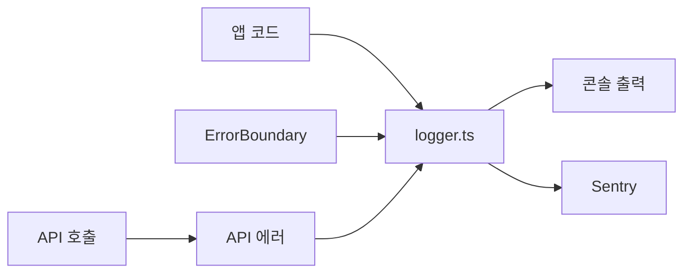

# 📊 KeywordPulse 로깅 및 모니터링 전략

이 문서는 KeywordPulse 프로젝트의 로깅, 에러 트래킹, 성능 모니터링 전략을 정의합니다. Sentry를 활용한 중앙 집중식 로깅 시스템과 사용자 경험 모니터링 방법을 설명합니다.

## 🎯 로깅 목표

- 애플리케이션 동작 흐름의 **투명한 가시성** 확보
- **에러 조기 감지** 및 신속한 해결 지원
- 사용자 경험 지표 추적을 통한 **성능 최적화**
- 로그 데이터 기반 **서비스 개선 인사이트** 확보

## 🧰 로깅 시스템 핵심 구성 요소

| 구성 요소 | 설명 |
|------------|------|
| Sentry 통합 | 에러 트래킹, 성능 측정, 세션 재생 |
| 중앙화된 로거 | `lib/logger.ts`를 통한 일관된 로깅 인터페이스 |
| ErrorBoundary | React 컴포넌트 에러 포착 및 대체 UI 제공 |
| 성능 측정 | 주요 API 호출 및 렌더링 성능 트랜잭션 추적 |

## 📝 로깅 상세 설계

### 1. 로그 레벨 및 구조

```typescript
type LogLevel = 'debug' | 'info' | 'warn' | 'error';

interface LogParams {
  message: string;
  level?: LogLevel;
  context?: Record<string, any>;
  user?: {
    id?: string;
    email?: string;
  };
  tags?: Record<string, string>;
  error?: Error;
}
```

### 2. 로깅 포인트 (사용 시점)

| 항목 | 로깅 시점 |
|------|----------|
| API 요청/응답 | API 호출 시작, 완료, 에러 발생 시 |
| 인증 관련 | 로그인, 로그아웃, 토큰 갱신, 인증 실패 시 |
| 데이터 처리 | 키워드 분석, RAG 텍스트 생성, 데이터 동기화 시 |
| 주요 사용자 액션 | 키워드 검색, 데이터 저장, 알림 전송 시 |
| 에러 상황 | 예외 발생, API 실패, 네트워크 오류 시 |

### 3. 로깅 시스템 아키텍처



## 🛠️ 구현 상세

### 1. 중앙화된 로거 (`lib/logger.ts`)

```typescript
// 로그 생성 예시
logger.log({
  message: '키워드 분석 완료',
  level: 'info',
  context: { keywordCount: 15, topScore: 95 },
  user: { id: user.id },
  tags: { module: 'analyzer' }
});

// 에러 로깅 예시
logger.error({
  message: 'API 호출 실패',
  error: e,
  context: { url: '/api/analyze', params },
  tags: { component: 'KeywordTable' }
});
```

### 2. ErrorBoundary 컴포넌트 (React)

- `components/ErrorBoundary.tsx`에서 UI 렌더링 에러 포착
- 실패한 컴포넌트 대신 대체 UI 렌더링
- Sentry로 에러 보고

### 3. 성능 모니터링 트랜잭션

```typescript
const transaction = logger.startTransaction('analyzeKeywords', 'api.call');
try {
  // 작업 수행
  transaction?.setData('keywordCount', keywords.length);
} finally {
  transaction?.finish();
}
```

## 📊 모니터링 대시보드

Sentry 대시보드에서 다음 항목을 모니터링:

- 실시간 에러 발생 및 해결 상태
- 사용자별/브라우저별/OS별 에러 분포
- 성능 트랜잭션 소요 시간 분석
- 세션 재생을 통한 사용자 경험 관찰

## 🔄 로깅 및 RAG 시스템 연계

RAG 시스템의 텍스트 생성 과정에서 다음 항목을 로깅:

1. 텍스트 생성 요청 (입력 키워드 및 점수)
2. 템플릿 선택 결과
3. 최종 출력 텍스트 길이 및 구조
4. 생성 소요 시간

```typescript
// RAG 텍스트 생성 시 로깅 예시
logger.log({
  message: 'RAG 텍스트 생성 완료',
  context: {
    templateType: 'keyword_analysis',
    inputKeywords: keywords.length,
    outputLength: analysisText.length,
    generationTimeMs: endTime - startTime
  },
  tags: { module: 'rag_engine' }
});
```

## 📈 로깅 데이터 분석 및 활용

수집된 로그 데이터를 기반으로:

- 가장 자주 발생하는 에러 패턴 파악 및 우선 수정
- 느린 API 호출 또는 렌더링 구간 식별 및 최적화
- 사용자 행동 패턴 분석을 통한 UI/UX 개선
- 데이터 기반 RAG 시스템 템플릿 개선

## 🔗 관련 문서

- [RAG 시스템 문서] → 텍스트 생성 로직 로깅 포인트 참조
- [리팩토링 전략] → 로깅 코드 분리 및 최적화 방향
- [WBS 계획표] → 로깅 시스템 구현 및 모니터링 구축 일정
- [디버깅 문서] → 에러 패턴 및 로깅 기반 디버깅 전략

---

> 이 문서는 KeywordPulse의 로깅 전략과 모니터링 시스템 구현에 대한 지침을 제공합니다. 개발 및 운영 전반에 걸쳐 일관된 로깅 방식을 적용하여 안정적인 서비스 제공을 지원합니다. 